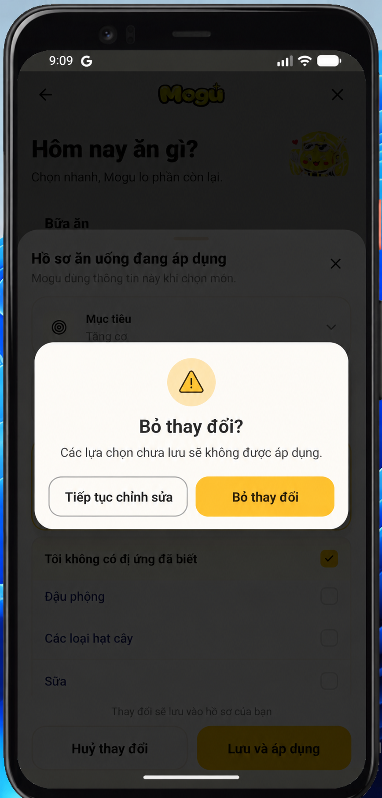

# ConfirmDialog dùng chung cho mobile

Component: `mobile/src/components/ui/confirm-dialog.tsx`.



## Khi nào dùng

Dùng cho hành động có thể làm mất dữ liệu hoặc thay đổi phạm vi gợi ý: bỏ thay đổi chưa lưu, xoá dị ứng, xoá kế hoạch, bỏ món đã lưu. Không dùng cho lỗi/thành công ngắn; dùng toast cho các trạng thái đó.

## Hành vi

- Có ba tone: `warning` (vàng, như bỏ thay đổi), `danger` (đỏ, như xoá dữ liệu) và `info`.
- Luôn có hai lựa chọn rõ nghĩa: giữ/huỷ ở bên trái và hành động xác nhận ở bên phải. Không dùng nhãn chung chung như `OK`.
- Với hành động quan trọng, truyền `dismissOnBackdrop={false}`: không đóng bằng tap nền hay nút Back Android. Người dùng phải chọn một trong hai hành động.
- Hai nút cao 52dp, có phản hồi khi nhấn; icon, tiêu đề và copy cùng truyền đạt mức độ cảnh báo, không chỉ dựa vào màu.
- Khi `loading`, cả hai hành động bị khoá và nút xác nhận hiển thị `Đang xử lý…`.

## API component

```tsx
<ConfirmDialog
  visible={visible}
  tone="warning"
  title="Bỏ thay đổi?"
  description="Các lựa chọn chưa lưu sẽ không được áp dụng."
  cancelLabel="Tiếp tục chỉnh sửa"
  confirmLabel="Bỏ thay đổi"
  dismissOnBackdrop={false}
  onCancel={close}
  onConfirm={discard}
/>
```

## Đã áp dụng

Toàn bộ ứng dụng mobile đã thay các `Alert.alert` mang tính xác nhận bằng `ConfirmDialog` chuẩn thiết kế Mogu:

- `RandomProfileSheet`: Bỏ thay đổi hồ sơ chưa lưu, xoá dị ứng đã lưu.
- `WeeklyPlanScreen`: Xác nhận tạo lại thực đơn tuần (thay thế modal cũ và native alert).
- `ProfileScreen`: Xác nhận đăng xuất, đăng xuất thiết bị khác, xoá lịch sử Random, xoá dữ liệu sức khoẻ, gửi yêu cầu xoá tài khoản.
- `ImageUploadField`: Xác nhận xoá ảnh tải lên.
- `LoginForm`: Hộp thoại thông báo Quên mật khẩu.

Như vậy không còn lẫn UI Alert mặc định Android với các giao diện mang nhận diện Mogu.
