# Thiết kế lại toàn bộ Khám phá trên mobile

Ngày: 17/09/2026. Phạm vi: đánh giá 6 ảnh giao diện người dùng cung cấp, `ExploreScreenV2.tsx`, `ExploreDetailScreen.tsx`, `CommunityPostDetailScreen.tsx` và contract `services/api/explore.ts`. Đây là đề xuất UX + concept UI, **chưa thay đổi code**.

## Kết luận

Khám phá hiện tại hoạt động như một “trang danh mục”: logo + tiêu đề lớn + search cố định + 4 tab + filter theo tab + nhiều section có `Xem tất cả`. Cấu trúc này tạo quá nhiều lớp điều hướng trước khi người dùng nhìn thấy nội dung và buộc họ đọc nhiều chữ để hiểu từng card.

Đề xuất chuyển thành **visual-first mixed feed**:

```text
Khám phá
  ├─ Dành cho bạn: món ăn + bài viết + post cộng đồng trong một feed cá nhân hóa
  ├─ Đang theo dõi: nội dung từ creator đã follow
  ├─ Search: tìm món, bài viết, người dùng trong màn riêng
  ├─ Cộng đồng: feed post ảnh/video khi backend hỗ trợ
  ├─ Article reader: nội dung biên tập đã render đúng định dạng
  └─ Post detail: media + tương tác + bình luận
```

Không sao chép TikTok/Instagram/Facebook. Bản thiết kế chỉ áp dụng các pattern có ích: media là nội dung chính, caption ngắn, tương tác nhất quán, feed học từ hành vi và người dùng có thể điều chỉnh gợi ý.

## Concept UI

### Feed Dành cho bạn

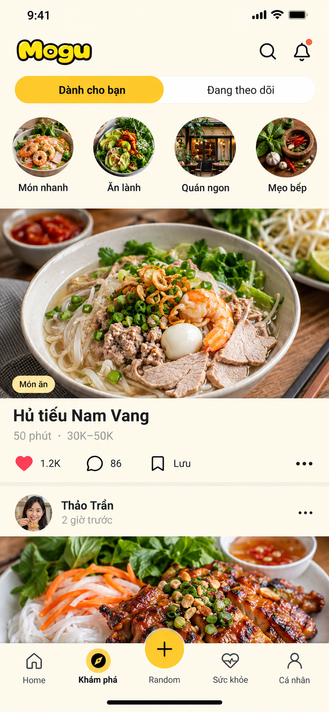

### Feed Cộng đồng

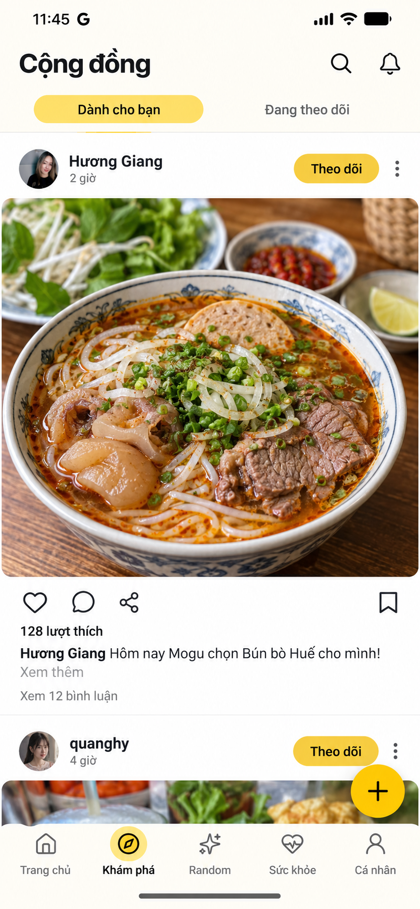

### Tìm kiếm riêng

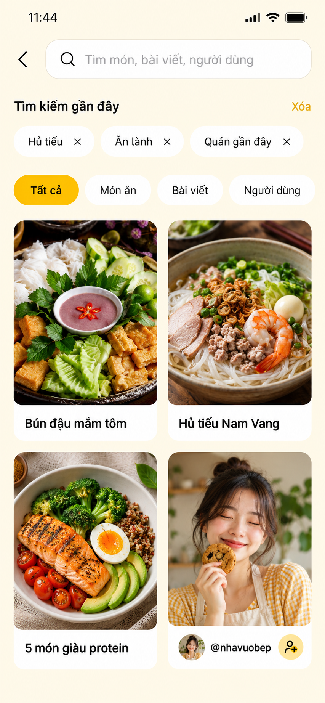

### Article reader

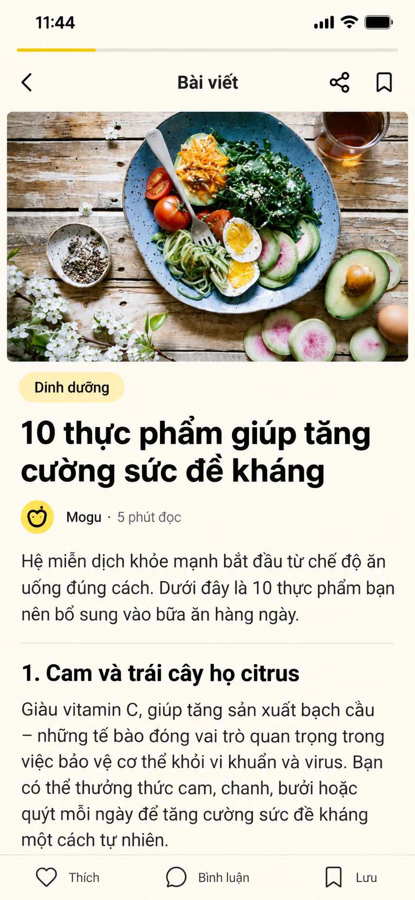

### Chi tiết bài đăng và bình luận

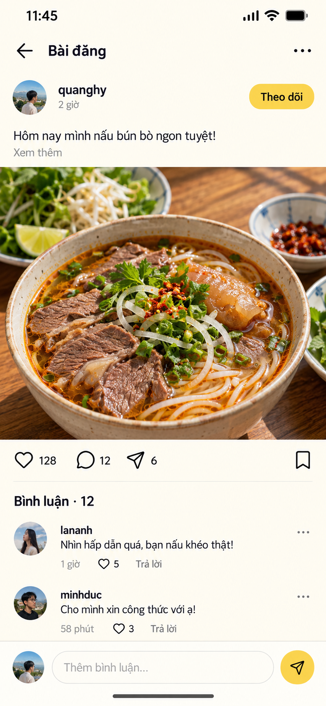

### Tạo bài viết — trạng thái ban đầu

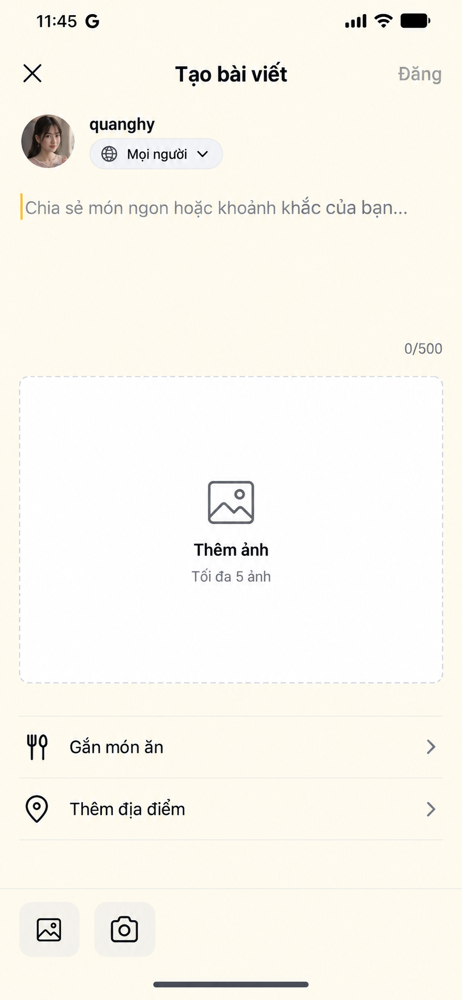

### Tạo bài viết — sẵn sàng đăng

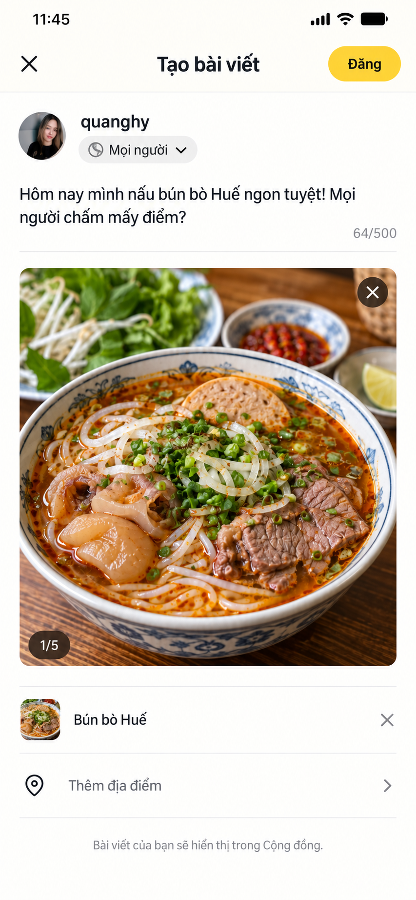

Năm ảnh là **concept tạo bằng built-in ImageGen**. Ảnh, creator, lượt tương tác và nội dung trong mockup là minh họa; production phải dùng dữ liệu/API thật và asset chính thức trong repo.

## Vấn đề của thiết kế hiện tại

### Quá nhiều navigation chrome

- Header cao gồm logo, notification, avatar, title `Khám phá`, search bar và bốn tab; nội dung thật bắt đầu rất thấp.
- Tab `Món ăn` và `Bài viết` có thêm hàng filter, tạo hai hàng chip cuộn ngang liên tiếp.
- `Dành cho bạn` lại chia `Chủ đề hôm nay`, `Bài viết nổi bật`, `Cộng đồng đang nói gì?`; người dùng liên tục đổi cách quét.
- Nút tạo post và nút Random ở bottom nav cùng nổi bật bằng vàng, cạnh tranh vai trò primary action.

### Card nhiều chữ, media chưa phải nội dung chính

- Food card gồm ảnh nhỏ, tên, metadata, mô tả; article card tương tự nhưng có topic/read time/save. Cấu trúc ngang làm ảnh nhỏ và text dễ bị cắt.
- Community post text-only tạo vùng trắng lớn nhưng ít thông tin; `imageUrls` đã có trong contract nhưng feed chưa ưu tiên media.
- Caption, mô tả và summary thường được hiển thị cùng lúc thay vì progressive disclosure.

### Hành vi chưa nhất quán

- Search placeholder và endpoint thay đổi theo tab; ở `Dành cho bạn`, nhập text tự chuyển sang `Món ăn`, nên không thể tìm bài viết/người dùng toàn cục.
- `savedArticles` chỉ là state local; refresh/mở lại app mất trạng thái.
- Post detail có save/follow local trong khi API save/follow đã tồn tại.
- Like có optimistic update, nhưng post detail chưa đồng bộ `commentCount`/save/follow nhất quán với feed.

### Nội dung chi tiết chưa được trình bày đúng dạng

- Article hiện để lộ Markdown thô như `##`, `###`; header dùng thêm wordmark làm giảm không gian đọc.
- Post detail hiển thị timestamp đầy đủ tới giây, khó quét hơn relative time.
- Post không có ảnh tạo màn chi tiết rất trống; comment composer lại nằm xa nội dung trên máy cao.

### Hiệu năng feed

- Root dùng `ScrollView` và map toàn bộ món/article/post. Khi pagination/media tăng, tất cả item render cùng lúc.
- API có `nextCursor/hasMore` nhưng UI chưa load-more.
- Feed ảnh nên dùng virtualized list và `expo-image` cache; media phải có kích thước/aspect ratio ổn định để tránh layout shift.

## Tham khảo sản phẩm xã hội

- [TikTok — How TikTok recommends videos](https://newsroom.tiktok.com/how-tiktok-recommends-videos-for-you?lang=en) mô tả feed riêng cho từng người dựa trên tương tác, thông tin nội dung và một phần cài đặt; completion được xem là tín hiệu mạnh hơn một số tín hiệu yếu. Bài học: Mogu nên học từ mở detail, save, thời gian đọc/xem và `Không quan tâm`, không chỉ từ lượt thích.
- [TikTok — diversify recommendations](https://newsroom.tiktok.com/an-update-on-our-work-to-safeguard-and-diversify-recommendations?lang=en) nói về việc xen kẽ nội dung đa dạng để ngắt chuỗi lặp. Bài học: không để feed chỉ toàn “ăn lành” hoặc chỉ một món dù user tương tác gần đây.
- [TikTok — Why this video](https://newsroom.tiktok.com/learn-why-a-video-is-recommended-for-you?lang=en) cho người dùng hiểu lý do được gợi ý. Bài học: menu post có `Vì sao bạn thấy nội dung này?` và `Ít nội dung như thế này`.
- [Meta — Customize Facebook Feed](https://about.fb.com/news/2022/10/new-ways-to-customize-your-facebook-feed/) cho phép Interested/Not interested để tác động ranking. Bài học: feedback trực tiếp phải có đường đi rõ từ menu ba chấm.
- [Meta — Home and Feeds](https://about.fb.com/news/2022/07/home-and-feeds-on-facebook/) tách Home discovery được xếp hạng khỏi Feeds theo kết nối. Bài học: hai lựa chọn `Dành cho bạn` và `Đang theo dõi` đủ rõ hơn bốn content-type tab.
- [Meta — More Control and Context](https://about.fb.com/news/2021/03/more-control-and-context-in-news-feed/) mô tả suggested posts dựa trên related engagement/topics/location và cung cấp context. Bài học: Mogu cần reason code đọc được, không gắn nhãn `Dành cho bạn` chung chung.

Các nguồn trên mô tả pattern và hệ thống recommendation của từng sản phẩm, không chứng minh cùng thuật toán sẽ phù hợp Mogu.

## Kiến trúc thông tin đề xuất

### Header

- Wordmark nhỏ bên trái; search icon và notification bên phải.
- Bỏ heading `Khám phá` cỡ lớn và search field cố định. Tap search icon mở màn search riêng, bàn phím focus ngay.
- Avatar thuộc tab Cá nhân; không cần lặp ở header nếu bottom nav đã có Cá nhân.

### Primary feed switch

- Chỉ hai trạng thái `Dành cho bạn` và `Đang theo dõi`.
- `Món ăn`, `Bài viết`, `Người dùng` trở thành filter của search, không phải top-level tab.
- Nếu product vẫn cần entry Cộng đồng riêng, mở từ topic/action hoặc dùng screen title `Cộng đồng`; không trộn thêm vào hàng primary switch.

### Topic row

- 4–6 topic dạng ảnh tròn: `Món nhanh`, `Ăn lành`, `Quán ngon`, `Mẹo bếp`.
- Chạm topic mở topic feed; không cần heading `Chủ đề hôm nay` và `Xem tất cả`.
- Topic không auto-rotate; row cuộn ngang có target ≥48dp.

## Feed Dành cho bạn

- Dùng một `FlatList`/`FlashList` hỗn hợp các item có discriminator `dish|article|post|topicPrompt`.
- Media rộng toàn content column, aspect ratio cố định theo loại. Text đứng dưới media, không nhồi cạnh ảnh.
- Dish item: label nhỏ `Món ăn`, tên, tối đa ba metadata; tap mở Food Detail.
- Article item: hero, topic, title tối đa 2 dòng, read time; tap mở reader.
- Community item: author row, media, action row, caption tối đa 2 dòng; tap mở post detail.
- Action row nhất quán: like, comment, share, save, more. Không hiển thị action không hoạt động.
- Menu more: `Không quan tâm`, `Ít nội dung chủ đề này`, `Vì sao tôi thấy nội dung này?`, report khi phù hợp.
- Xen kẽ nội dung để tránh 3–4 item cùng topic/type liên tiếp; đây là diversity policy, cần đo lường.

## Feed Cộng đồng

- Ảnh/video (sau khi API hỗ trợ) là trọng tâm; post text-only dùng compact composer card, không kéo cao như post có ảnh.
- Author row: avatar, tên, relative time, follow và more.
- Caption tối đa 2 dòng + `Xem thêm`; `Xem N bình luận` mở detail.
- Double-tap like chỉ là shortcut, vẫn giữ button Heart cho accessibility.
- Create button nhỏ nằm trên bottom nav; chỉ dùng tại Community hoặc khi mục đích rõ. Không cạnh tranh với center Random button: có thể đặt create ở header hoặc dùng FAB nhỏ lệch phải.
- Post upload cần progress, retry, alt text/caption và quyền xoá/sửa cho owner.

## Tạo bài viết từ nút plus

### Kiểu điều hướng

- Nút plus mở **màn full-screen**, không mở modal card trên feed. Composer cần đủ chỗ cho keyboard, media preview và lỗi upload.
- X đóng composer. Nếu đã có caption/ảnh/tag chưa đăng, hỏi `Lưu bản nháp / Bỏ / Tiếp tục chỉnh sửa`; nếu rỗng thì đóng ngay.
- Không hiển thị bottom navigation trong composer để tránh chuyển tab và mất draft.

### Header và tác giả

- Header chỉ có X, `Tạo bài viết`, `Đăng`.
- `Đăng` disabled khi caption rỗng và không có ảnh; enabled khi có ít nhất một loại nội dung hợp lệ.
- Author row có avatar, display name và audience selector. V1 dùng `Mọi người`; chỉ hiển thị lựa chọn khác khi backend thực sự hỗ trợ visibility.

### Caption

- Một textarea borderless, placeholder `Chia sẻ món ngon hoặc khoảnh khắc của bạn…`, tối đa 500 ký tự.
- Counter luôn rõ nhưng giảm emphasis; gần giới hạn đổi trạng thái bằng icon/text, không chỉ màu.
- Không bắt title, hashtag hoặc category. Mention/hashtag chỉ bổ sung sau khi có search/index/moderation tương ứng.

### Ảnh và camera

- Empty state có một vùng `Thêm ảnh · Tối đa 5 ảnh`, cùng shortcut Gallery/Camera ở keyboard accessory.
- Sau khi chọn: preview lớn là nội dung chính; badge `1/5`, X để xoá, hỗ trợ reorder khi nhiều ảnh và giữ aspect ratio.
- Upload bắt đầu khi người dùng đăng hoặc pre-upload có draft ID; phải có progress, retry từng ảnh, cancel và compression rõ ràng.
- Ảnh cần width/height, mime type, size, storage key/URL và optional alt text. Không chỉ gửi URL client tự ghép.

### Tag món và địa điểm

- `Gắn món ăn` và `Thêm địa điểm` là optional rows, không phải field bắt buộc.
- Gắn món mở search dish và lưu `dishId`, không chỉ chèn text. Selected state hiển thị thumbnail + tên + X.
- Địa điểm cần provider/place ID và quyền vị trí rõ; không lưu chuỗi tuỳ ý như dữ liệu đã xác minh.
- Helper cuối màn nói rõ nơi hiển thị: `Bài viết của bạn sẽ hiển thị trong Cộng đồng.`

### Publish states

- Khi bấm `Đăng`: khoá double tap, hiện progress trong button, giữ draft đến khi server trả post canonical.
- Thành công: đóng composer, prepend post thật vào feed và toast `Đã đăng bài`.
- Lỗi: giữ nguyên caption/media/tag; lỗi gần header/footer với `Thử lại`, không xoá draft.
- Offline: cho `Lưu bản nháp`, không giả đăng thành công. Draft chứa local asset URI và phải xử lý khi file bị xoá/quyền ảnh đổi.
- Moderation/policy error phải nói rõ phần nào cần sửa; không dùng lỗi chung cho mọi trường hợp.

### Gap implementation hiện tại

- `ExploreScreenV2` đang dùng `Modal` + `Textarea` chỉ gửi `{ content }`; UI chưa có image picker/upload, audience, dish/location tag, draft hoặc upload progress.
- Contract `createPost({ content, imageUrls? })` cho phép URL nhưng chưa thể hiện upload ownership, media dimensions/order/alt text. Nên dùng media IDs từ upload service thay vì nhận URL tuỳ ý.
- Cần thêm `visibility`, `dishId?`, `placeId?`, `media[]`, idempotency key và moderation status vào create-post contract.
- Nút plus chỉ nên hiện trong ngữ cảnh Community hoặc label/hint phải nói rõ `Tạo bài viết`, tránh người dùng tưởng đây là thêm món/công thức.

## Màn tìm kiếm

- Search là route riêng: back + field autofocus.
- Một hàng filter duy nhất: `Tất cả`, `Món ăn`, `Bài viết`, `Người dùng`.
- Khi chưa nhập: recent searches + topic suggestions. Khi có query: kết quả visual grid/list theo loại.
- `Tất cả` dùng grid 2 cột cho discovery; tên tối đa 2 dòng, không description paragraph.
- Món có metadata tối thiểu; article có type/read time; creator có avatar, handle và follow.
- Debounce 300–400ms, cancel request cũ, history local có xoá từng item/toàn bộ.

## Article reader

- Render Markdown/structured content thành component; tuyệt đối không hiển thị ký tự `##`, `###`.
- Header gọn: back, `Bài viết`, share, save. Reading progress 2px.
- Hero → topic → title → author/read time → lead → sections.
- Body 17sp, line-height khoảng 27, paragraph spacing 16–20; heading không nằm cuối viewport một mình.
- Sticky action bar tối thiểu like/comment/save; content có bottom inset.
- Thông tin sức khỏe phải có author/reviewer/provenance và disclaimer phù hợp; không tạo medical claim từ UI.

## Post detail và bình luận

- Header chỉ back, title và more; save/share nằm ở action row để tránh lặp.
- Author + caption ngắn → media → action row → comments.
- Relative time trong feed/detail; timestamp đầy đủ chỉ trong accessibility/menu nếu cần.
- Comment item không có card riêng: avatar, author, text, relative time, like, reply.
- Composer luôn ở đáy, safe area + keyboard avoiding; giữ draft nếu gửi lỗi.
- Empty state không để khoảng trắng vô nghĩa: `Chưa có bình luận · Hãy bắt đầu cuộc trò chuyện` gần composer.
- Reply phải gửi `parentCommentId` thật; implementation hiện tạo mention nhưng chưa truyền parent ID.

## Data/API gap

- Feed endpoint hiện chỉ trả `topics`, một `featuredArticle`, `recentPosts`; cần feed items đã xếp hạng, cursor pagination, `reasonCode`, stable `rankingToken` và diversity metadata.
- `ExplorePost` cần `isSaved`, `isFollowingAuthor`, media type/dimensions/thumbnail/alt text; hiện chỉ có `imageUrls`.
- Article cần persisted save/like/comment state, `contentFormat`, author/reviewer và publish/update time.
- Dish card cần image URL trực tiếp hoặc shared media mapper; không tự ghép Supabase public URL ở screen.
- Like/save/follow response cần count/state canonical để optimistic update reconcile.
- Search nên có unified endpoint hoặc orchestration trả type + relevance; hiện community search param có nhưng `fetchPosts()` không truyền `searchQuery`.
- Recommendation feedback: `NOT_INTERESTED`, `MORE_LIKE_THIS`, `LESS_TOPIC`, `HIDE_AUTHOR`, `WHY_THIS`.
- Impressions phải log khi item thực sự visible đủ ngưỡng, không phải khi render.

## Visual system

- Cream giữ làm nền thương hiệu; media và white surface tạo tương phản. Yellow chỉ cho selected/follow/create/active nav.
- Feed tránh card + shadow quanh mọi item; dùng divider 1px và whitespace.
- Gutter 16dp, post gap 20–24dp; media radius 12–16dp hoặc edge-to-edge nhất quán.
- Type scale 12/14/16/20/28; caption 15–16sp, line-height ≥1.4; clamp 2 dòng.
- Icon 22–24dp, một family/stroke; target 44pt iOS/48dp Android.
- Bottom nav không glass blur dày che feed; content inset đúng chiều cao nav/safe area.

## Performance và accessibility

- Thay root `ScrollView` + `.map()` bằng virtualized list, cursor load-more và item key ổn định.
- `expo-image`, `cachePolicy="memory-disk"`, thumbnail trước full image, đặt aspect ratio/kích thước từ API.
- Autoplay video chỉ item đang active; muted default theo policy, caption/control pause; reduced motion tắt autoplay nếu phù hợp.
- Mỗi media có accessibility label/alt; button icon có name/state; like/save công bố selected.
- Focus order: author → media → caption → actions. Dynamic Type không chồng action row.
- Loading dùng skeleton cùng aspect ratio; lỗi từng item không làm sập feed; pull-to-refresh giữ item cũ.

## Đo lường

- Discovery: unique content opened/session, save rate, meaningful dwell, topic diversity, hide/not-interested rate.
- Social: comment/reply rate, follow conversion, share success; không tối ưu chỉ theo time spent.
- Search: query success, zero-result rate, result-open rate và query reformulation.
- Guardrail: report rate, repeated-topic exposure, accidental tap, latency to first media, crash/memory.
- A/B so sánh UI cũ/mới trên thời gian tới nội dung đầu tiên, scroll depth, open detail và số backtrack giữa tab.

## Thứ tự triển khai

1. **P0:** hợp nhất IA thành `Dành cho bạn / Đang theo dõi`, search route riêng; bỏ header/section dư.
2. **P0:** feed component thống nhất và virtualized; article render đúng; post detail không khoảng trắng lớn.
3. **P0:** bỏ dữ liệu/hành động local giả; nối save/follow/reply đúng API.
4. **P1:** unified search, cursor pagination, media metadata và create-post upload.
5. **P1:** recommendation reason/feedback, impression logging và diversity guardrail.
6. **P2:** video/reels chỉ sau khi media pipeline, moderation, caption và playback policy sẵn sàng.

## Prompt set tạo concept

Built-in ImageGen, taxonomy `ui-mockup`, năm prompt: (1) visual-first personalized feed với two-way switch và topic circles; (2) community photo feed; (3) dedicated unified search + two-column grid; (4) formatted article reader; (5) post detail with photo/comments/composer. Mogu cream/yellow, ít card/shadow, caption ngắn, không mascot, raw Markdown, glass nav hoặc dữ liệu giả được xem như production.

---

## Bổ sung: interaction spec cho composer và menu nội dung

Phần này là handoff trực tiếp cho Product, FE và BE. Các bottom sheet dưới đây là **component/state bổ sung**, không phải route độc lập. Feed và post detail phải gọi cùng một action sheet theo `contentType` và quyền sở hữu để tránh hai menu khác nhau.

### Gắn món ăn

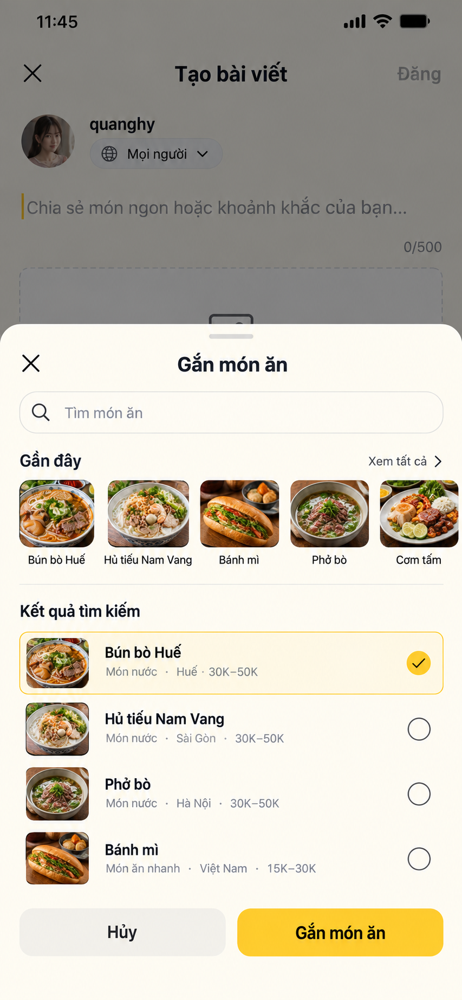

Luồng: `Tạo bài viết → Gắn món ăn → tìm/chọn một món → Gắn món ăn`. V1 chỉ cho phép một món vì card post và analytics đang có một primary subject. Search debounce 300 ms; recent có thể lưu local. Khi chọn, composer hiển thị thumbnail + tên + nút X. Tap card mở lại sheet; X chỉ bỏ liên kết, không xóa ảnh/caption.

Trạng thái bắt buộc: loading skeleton, không có kết quả, mất mạng + thử lại, món đã bị unpublish, selected. Nút xác nhận disabled khi chưa chọn. Không gửi tên món làm nguồn sự thật; gửi `dishId`.

### Thêm địa điểm

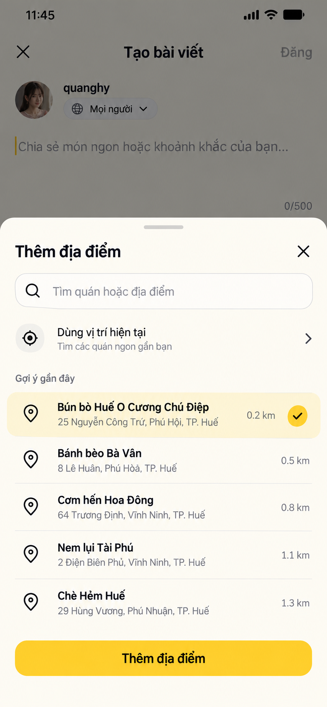

Luồng: `Tạo bài viết → Thêm địa điểm → cho phép vị trí hoặc nhập từ khóa → chọn một place → Thêm địa điểm`. Không bật permission ngay khi mở sheet; chỉ hỏi khi user chạm `Dùng vị trí hiện tại`. Nếu từ chối, search vẫn hoạt động. V1 không cần bản đồ lớn.

Selected state trong composer: pin + tên quán, địa chỉ ngắn và X. Production lưu provider/place ID, tọa độ snapshot và display name; không coi chuỗi người dùng nhập là địa điểm đã xác minh. Nếu place đóng cửa/xóa sau khi đăng, post vẫn giữ snapshot nhưng detail ghi trạng thái phù hợp.

### Chọn đối tượng xem

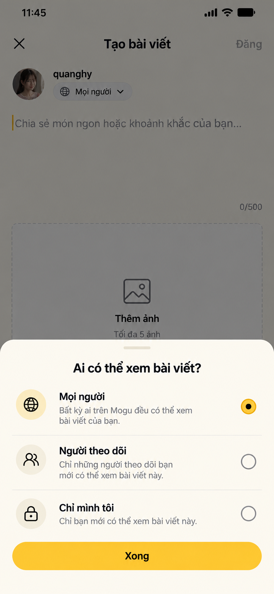

`Mọi người`, `Người theo dõi`, `Chỉ mình tôi` là radio, một lựa chọn. V1 chỉ được hiển thị lựa chọn mà BE thực sự enforce. Nếu chưa làm access control, khóa UI ở `Mọi người`; không tạo cảm giác riêng tư giả. Đổi visibility của bài đã đăng phải cập nhật feed/cache và deep link ngay.

### Menu nội dung hệ thống

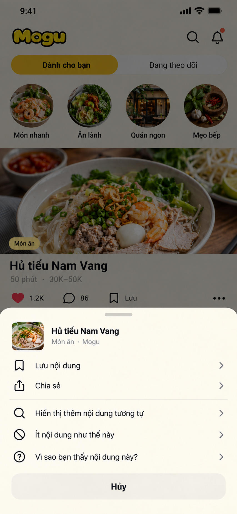

Áp dụng cho dish/article do Mogu phát hành hoặc gợi ý. Không hiển thị `Báo cáo người đăng`, `Theo dõi` hay `Xóa`. Menu gồm lưu/bỏ lưu, chia sẻ, thêm nội dung tương tự, ít nội dung tương tự, và lý do gợi ý. `Vì sao bạn thấy nội dung này?` mở sheet thứ hai chứa reason text từ `reasonCode`, không hiển thị score/thuật toán nội bộ.

### Menu bài của người khác

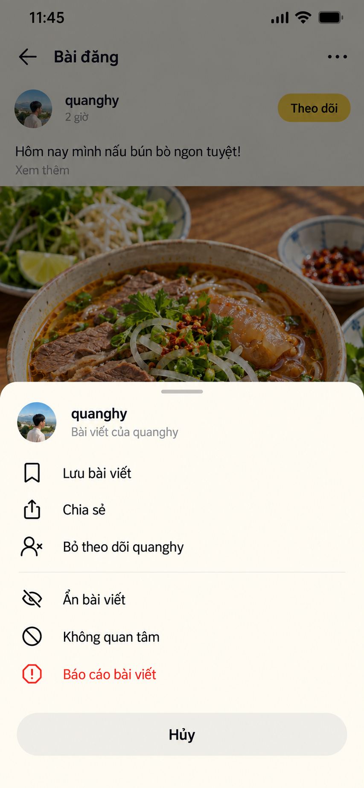

Thứ tự: hành động thường dùng (`Lưu`, `Chia sẻ`, follow/unfollow) → điều chỉnh feed (`Ẩn`, `Không quan tâm`) → safety (`Báo cáo`, màu đỏ). `Ẩn bài viết` chỉ loại item hiện tại; `Không quan tâm` vừa loại item vừa gửi feedback ranking; `Báo cáo` mở reason picker và không tự động block tác giả. Sau hành động phải có snackbar Undo với hide/not interested.

### Menu bài của chính mình — dùng chung ở feed và detail header

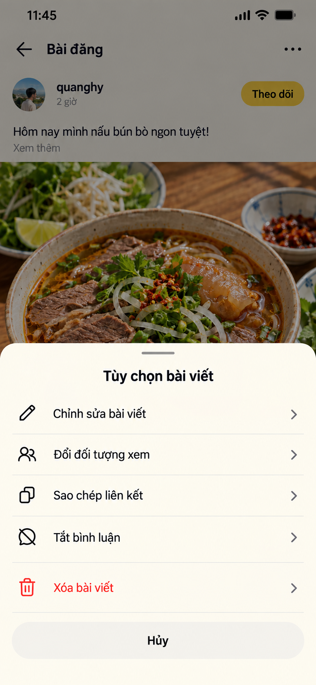

Menu ba chấm tại feed và header detail gọi cùng `PostActionSheet(post, viewerCapabilities)`. Owner có: chỉnh sửa, đổi đối tượng xem, sao chép liên kết, bật/tắt bình luận và xóa. Không hiển thị save/follow/report bài của chính mình. Xóa mở confirm riêng: `Xóa bài viết?` → `Hủy / Xóa`; optimistic remove chỉ sau khi server thành công hoặc phải rollback.

### Ma trận menu theo loại và quyền

| Action | System dish/article | Post người khác | Post của tôi | API hiện tại |
|---|---:|---:|---:|---|
| Lưu/bỏ lưu | Có | Có | Không | Dish/article/post đã có endpoint riêng |
| Chia sẻ / copy link | Có | Có | Có | FE share sheet; BE cần canonical deep link nếu chưa có |
| Follow/unfollow | Không | Có | Không | Đã có community follow |
| More/less similar | Có | Có thể | Không | Chưa có recommendation feedback |
| Ẩn item | Có thể | Có | Không | Chưa có |
| Báo cáo | Không ở menu chuẩn | Có | Không | Chưa có |
| Sửa / visibility / comment setting | Không | Không | Có | Sửa cơ bản đã có; visibility/comment setting chưa có |
| Xóa | Không | Không | Có | Đã có |

## Contract hiện có đã xác nhận trong code

- `GET/POST/PATCH/DELETE /community/posts...`: list, detail, tạo, sửa, xóa đã có.
- Like explicit/toggle, save/unsave post, follow/unfollow user, list/add/delete comment đã có.
- `CreateCommentDto.parentCommentId` đã tồn tại; FE cần truyền thật khi reply.
- `CreatePostDto` hiện chỉ có `content`, `imageUrls`, `status: ACTIVE|DRAFT`.
- `PATCH posts/:id` hiện nhận `content`, `imageUrls`, `status`; chưa có typed DTO cho dish/place/visibility/comments.
- Dish search/list đã có `GET /dishes`; lưu món đã có. Article save cũng đã có.
- Chưa tìm thấy API/product contract cho report, hide, mute, recommendation feedback, place search, post audience hoặc media upload dành cho community post.

## API cần bổ sung hoặc mở rộng

### 1. Composer payload

Khuyến nghị thay URL tự do bằng media ID do upload service cấp:

```json
POST /v1/community/posts
{
  "content": "Hôm nay mình nấu bún bò Huế ngon tuyệt!",
  "mediaIds": ["uuid-media-1"],
  "dishId": "uuid-dish",
  "placeId": "uuid-place",
  "visibility": "PUBLIC",
  "commentsEnabled": true,
  "status": "ACTIVE",
  "clientRequestId": "uuid-idempotency"
}
```

Response phải trả post canonical gồm `viewerCapabilities`, `dish`, `place`, `media[]`, `visibility`, `commentsEnabled`, `isSaved`, `isFollowingAuthor`, counts và moderation state. `clientRequestId` chống đăng trùng khi retry.

### 2. Media pipeline

```text
POST /v1/community/media/upload-intents
POST /v1/community/media/:mediaId/finalize
DELETE /v1/community/media/:mediaId
```

Upload intent nhận `mimeType`, `sizeBytes`, `width`, `height`, `checksum`; response trả signed upload URL + expiry. Finalize thực hiện ownership, virus/moderation check và trả trạng thái `PROCESSING|READY|REJECTED`. Create post chỉ nhận media READY thuộc user, tối đa 5, đúng thứ tự. FE cần progress/retry/cancel cho từng ảnh.

### 3. Dish picker

Dùng `GET /v1/dishes?q=&cursor=&limit=20`; response picker tối thiểu `id,name,slug,thumbnailUrl,prepMinutes,priceRange,status`. BE cần bảo đảm query này phục vụ published dish và có search không dấu. Nếu endpoint hiện tại đã đáp ứng thì không tạo endpoint mới, chỉ thêm typed mobile contract.

### 4. Place picker

```text
GET /v1/places/search?q=&lat=&lng=&cursor=&limit=20
POST /v1/places/resolve
```

Search trả `id,provider,providerPlaceId,name,addressShort,lat,lng,distanceMeters,thumbnailUrl?`. `resolve` dùng khi provider trả candidate chưa có trong DB. Không gửi location khi user chưa cho phép; làm tròn/giới hạn retention theo privacy policy.

### 5. Visibility và comment setting

```text
PATCH /v1/community/posts/:id
{ "visibility": "PUBLIC|FOLLOWERS|PRIVATE", "commentsEnabled": false }
```

BE enforce ở list, detail, comment, share/deep link; không chỉ lọc ở FE. Post response nên có `viewerCapabilities: {canEdit,canDelete,canReport,canComment,canChangeVisibility}` để FE không suy luận role/owner rải rác.

### 6. Report

```text
GET  /v1/moderation/report-reasons?targetType=COMMUNITY_POST
POST /v1/moderation/reports
{ "targetType":"COMMUNITY_POST", "targetId":"uuid", "reasonCode":"SPAM", "note":"..." }
```

POST idempotent theo user/target/reason trong cửa sổ chống spam; response `{reportId,status}`. Reason đề xuất: `SPAM`, `HARASSMENT`, `HATE`, `VIOLENCE`, `NUDITY`, `MISINFORMATION`, `OTHER`. Không cho report bài của mình. FE success sheet có lựa chọn bổ sung block/hide nhưng không nhập nhằng với report.

### 7. Hide và recommendation feedback

```text
PUT    /v1/me/hidden-content/:contentType/:contentId
DELETE /v1/me/hidden-content/:contentType/:contentId
POST   /v1/recommendation-feedback
{
  "contentType":"COMMUNITY_POST|DISH|ARTICLE",
  "contentId":"uuid",
  "action":"NOT_INTERESTED|MORE_LIKE_THIS|LESS_LIKE_THIS|HIDE_AUTHOR",
  "rankingToken":"opaque-token"
}
GET /v1/recommendations/explanations/:contentType/:contentId?rankingToken=...
```

Hide là user state có Undo; feedback là event cho ranking, không dùng toggle mơ hồ. Explanation trả reason code + localized message an toàn, ví dụ `Vì bạn đã lưu các món nước`.

### 8. Share/deep link

Server response nên có `shareUrl` canonical cho dish/article/post. FE dùng native share sheet; log `share_opened` và `share_completed` riêng. Với content private/deleted, deep link trả màn trạng thái hợp lệ, không leak caption/media.

## FE component contract đề xuất

```text
CreatePostScreen
 ├─ AudienceSheet
 ├─ MediaPicker / MediaUploadQueue
 ├─ DishPickerSheet
 └─ PlacePickerSheet

ContentActionSheet
 ├─ SystemContentActions
 ├─ OtherUserPostActions
 └─ OwnerPostActions
```

- `ContentActionSheet` nhận `content`, `viewerCapabilities`, `entryPoint: FEED|DETAIL`; action list do một pure function sinh ra.
- Dùng native/modal bottom sheet có focus trap, swipe/close, back Android và accessibility label. Touch target tối thiểu 48dp.
- Mỗi mutation dùng optimistic update có snapshot rollback; invalidate cùng entity key để feed/detail đồng bộ.
- Menu mở trong ≤100 ms bằng dữ liệu đã có; không chờ API để render. Chỉ reason/explanation/report reasons mới fetch sau.
- Analytics tối thiểu: `composer_picker_opened`, `dish_attached`, `place_attached`, `post_publish_started/succeeded/failed`, `content_menu_opened`, `content_action_selected`, kèm content type, entry point, không gửi caption/address thô.

## Error, permission và moderation rules

- `401`: giữ draft, đưa user qua login rồi resume. `403`: đóng action không còn quyền và refresh post. `404/410`: remove item, thông báo nội dung không còn. `409`: reconcile canonical post/idempotency. `422`: map lỗi vào media/caption/place cụ thể. `429`: giữ dữ liệu và hiển thị thời gian thử lại.
- Report/delete là action nguy hiểm: report cần reason, delete cần confirm. Save/follow/hide/not-interested không cần confirm; cung cấp Undo khi có thể.
- Place permission dùng `while-in-use`; không block composer nếu từ chối. Không hiển thị tọa độ chính xác trên post.
- Media rejected giữ caption/dish/place; chỉ đánh dấu ảnh lỗi và cho thay/xóa. Post `PENDING_MODERATION` không được giả là đã public.

## Acceptance criteria cho FE/BE

1. Gắn/bỏ món và địa điểm không làm mất caption/media; payload gửi ID, reload detail vẫn đúng.
2. Menu feed và detail cho cùng một post có cùng action theo capability; owner không thấy report/follow, người khác không thấy edit/delete.
3. Save/follow/edit/delete dùng API hiện có; không giữ state giả chỉ ở component.
4. Visibility được BE enforce trên list/detail/comment/deep link trước khi mở ba lựa chọn trong UI.
5. Hide/not interested biến mất ngay, Undo khôi phục; event có ranking token và không tạo duplicate khi retry.
6. Report có reason picker, idempotent, trạng thái success rõ; không tự động block/hide trừ khi user chọn.
7. Upload tối đa 5 ảnh, giữ thứ tự, có progress/retry; double tap Đăng không sinh hai post.
8. Tất cả sheet dùng được với screen reader, Dynamic Type, keyboard và Android back; action đỏ không nằm sát action thường dễ bấm nhầm.

---

## Bổ sung: article reader và topic article list V2

### Article reader V2

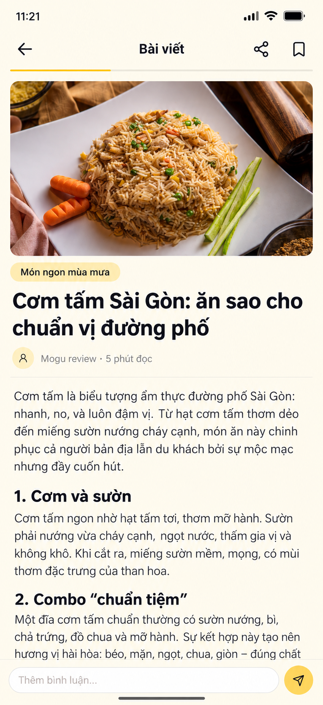

- Header gọn gồm back, `Bài viết`, share và save; progress đọc 2px nằm dưới header.
- Hero cố định tỷ lệ 16:9, có kích thước từ API để skeleton và ảnh thật không gây layout shift.
- Thứ tự nội dung: topic → tiêu đề → tác giả/thời gian đọc → body. Không đặt topic đè lên ảnh và không lặp metadata.
- Title 28sp; body 17sp, line-height khoảng 1.6; heading theo scale thống nhất. Markdown phải render thành component, không để lộ ký tự cú pháp.
- Bỏ toolbar `Thích / Bình luận / Chia sẻ / Lưu` chiếm chiều cao ở đáy. Share/save đã ở header; like/comment có thể đặt cuối bài hoặc trong comment section nếu product thực sự cần.
- Comment composer sticky giữ lại vì đây là hành động theo ngữ cảnh, có keyboard avoiding và bottom safe-area. Nội dung bài phải có inset để không bị composer che.
- Không hiển thị floating settings/debug control trong bản production.

### Topic article list V2

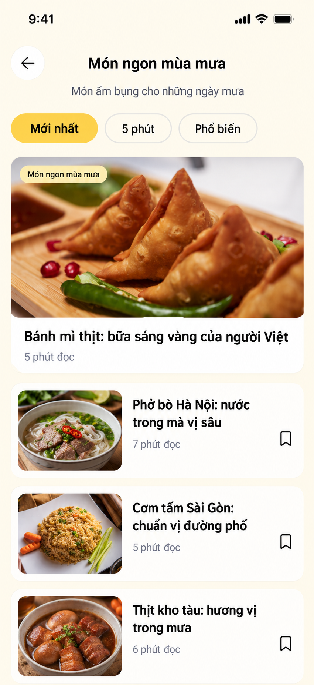

> **Thay đổi sau khi xác nhận nghiệp vụ:** concept V2 phía trên chỉ còn giá trị tham khảo về độ gọn. Màn mở từ topic header phải dùng **official post feed V3** bên dưới, vì article do Mogu đăng vẫn có like, comment, share và save. Không triển khai article catalog tĩnh.

### Topic official post feed V3 — phương án được chọn

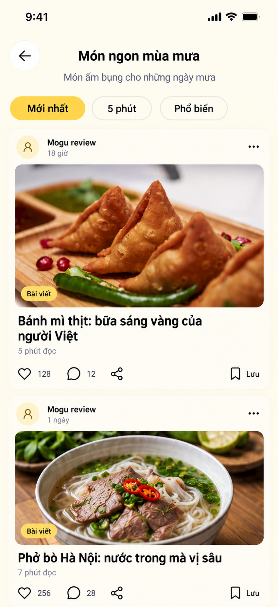

- Tap topic tròn ở header màn Khám phá mở một route topic feed, ví dụ `ExploreTopicFeed(topicId)`; không mở article detail và không mở catalog tĩnh.
- Header giữ tên chủ đề, mô tả ngắn và đúng ba lựa chọn `Mới nhất / 5 phút / Phổ biến`.
- Mỗi item là một `OfficialArticlePostCard`: author `Mogu review`, relative time, menu, hero image, badge `Bài viết`, title, read time và action row like/comment/share/save.
- Tap vùng nội dung hoặc title mở article reader. Tap comment mở cùng article reader nhưng scroll/focus tới comments. Các action khác không kích hoạt navigation của card.
- Menu ba chấm dùng `SystemContentActions` đã định nghĩa ở phần interaction spec; không hiển thị follow/report tác giả hệ thống trong menu mặc định.
- Feed sử dụng card cùng component/interaction state với official card tại `Dành cho bạn`; khác duy nhất là query bị giới hạn theo `topicId`.

- Header có back + tên chủ đề, thêm mô tả một dòng giúp người dùng hiểu phạm vi nội dung.
- Chỉ một hàng filter: `Mới nhất`, `5 phút`, `Phổ biến`. Nếu backend chưa hỗ trợ sort/duration thì bỏ filter, không hiển thị control giả.
- Một featured article ở đầu để tạo điểm nhấn; các bài còn lại dùng horizontal card với thumbnail 112×88, title tối đa 2 dòng, read time và save.
- Không dùng nhiều card dọc cao bằng nhau: màn hiện tại buộc người dùng cuộn nhiều và ảnh lỗi tạo vùng xám rất lớn.
- Ảnh lỗi giữ nguyên khung thumbnail và hiển thị fallback nhỏ có màu nền thương hiệu; không biến thành một card media rỗng. Có skeleton cùng kích thước khi tải.
- Toàn hàng là touch target mở article; save có vùng chạm riêng ≥44pt và không trigger navigation.

### Data/API tối thiểu

```ts
type TopicArticleItem = {
  id: string;
  slug: string;
  title: string;
  summary?: string;
  coverImageUrl?: string;
  coverImageWidth?: number;
  coverImageHeight?: number;
  readMinutes: number;
  publishedAt: string;
  isSaved: boolean;
  isLiked: boolean;
  likeCount: number;
  commentCount: number;
  shareCount?: number;
  viewerCapabilities: {
    canLike: boolean;
    canComment: boolean;
    canShare: boolean;
    canSave: boolean;
  };
  topic: { id: string; slug: string; title: string };
};
```

- List: `GET /v1/articles?topicId=&sort=latest|popular&maxReadMinutes=&cursor=&limit=`.
- Response list phải trả interaction state/count canonical; không để FE tự ghép article với một community post khác.
- Article chính thức nên là một social content entity hoặc có `engagementTargetId` ổn định. Like/comment/save ở feed và reader phải cùng trỏ đến target này.
- Nếu giữ API theo article: bổ sung `PUT/DELETE /v1/articles/:id/likes/me`, `GET/POST /v1/articles/:id/comments` và share analytics. Nếu dùng engagement service chung: `PUT /v1/engagements/ARTICLE/:id/likes/me`, tương tự cho comments; chọn một hướng duy nhất.
- Detail cần thêm `contentFormat`, `publishedAt`, `updatedAt`, `isSaved`, author và optional reviewer/provenance.
- Save dùng endpoint article save hiện có; FE optimistic update nhưng rollback khi lỗi.
- Cursor pagination, pull-to-refresh và cache theo `topicId + filter`. Không tải toàn bộ article bằng `ScrollView.map`.

### Acceptance criteria

1. Màn list không có vùng placeholder cao quá thumbnail khi ảnh lỗi/loading; cuộn không nhảy layout.
2. Title hai dòng không đẩy save icon ra ngoài; Dynamic Type lớn vẫn đọc được và action không chồng nhau.
3. Reader không hiển thị raw Markdown; heading có hierarchy liên tục, body đạt contrast tối thiểu 4.5:1.
4. Header, composer và home indicator đều tôn trọng safe area; đoạn cuối bài không bị che.
5. Save state đồng bộ giữa list, reader và mục đã lưu sau refresh.
6. Like/comment count và state của official article đồng bộ giữa `Dành cho bạn`, topic feed và article reader.
7. Tap comment từ card mở đúng comment section; tap like/share/save không đồng thời mở detail.

### Article social detail V3 — Like, Comment, Share

Article do `Mogu review` đăng là một social content entity. Reader vẫn ưu tiên khả năng đọc; engagement được đặt **sau nội dung bài**, không tạo toolbar nổi che đoạn văn.

#### Cuối bài và comment preview

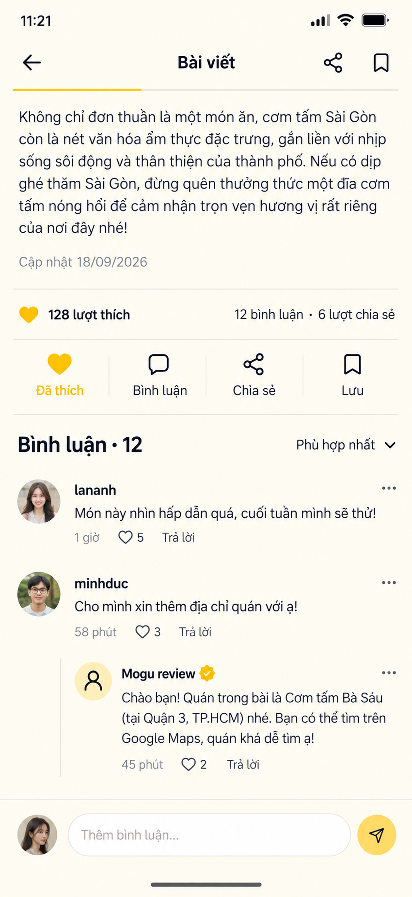

- Sau đoạn cuối: ngày cập nhật → tổng `like/comment/share` → một action row `Like / Bình luận / Chia sẻ / Lưu`.
- Like selected dùng icon filled + label `Đã thích`; state không chỉ thể hiện bằng màu và phải announce `selected` cho screen reader.
- Comment preview hiển thị 2–3 thread phù hợp nhất, reply được indent một cấp. Reply sâu hơn dùng `Xem thêm N câu trả lời`, không tiếp tục indent vô hạn.
- Official reply có badge xác minh riêng; badge không thay thế tên tác giả.
- Composer sticky ở đáy, có keyboard avoiding và gửi disabled khi text chỉ chứa whitespace.

#### Màn tập trung bình luận và reply

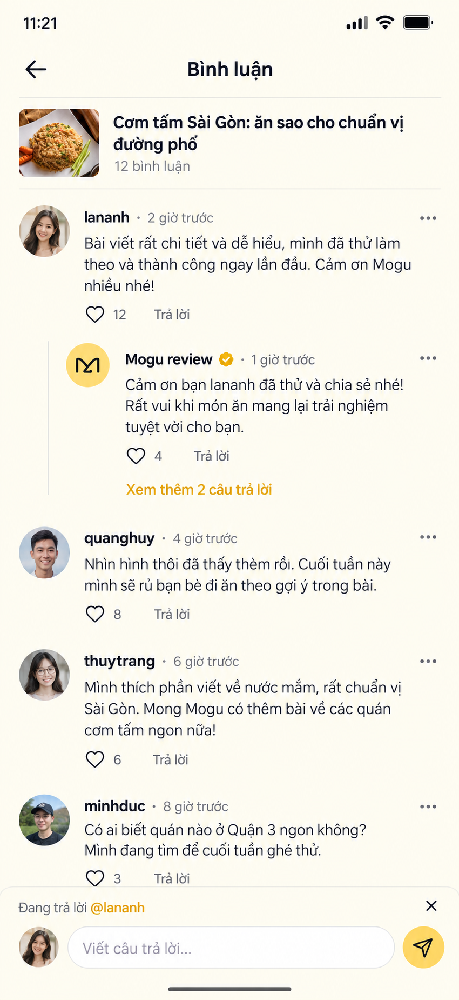

- Tap `Bình luận`, count hoặc `Xem tất cả` mở route/sheet comments với compact article context ở đầu.
- Comment item: avatar, display name, relative time, content, like count, reply và menu. Không bọc từng comment trong card.
- Khi reply, composer hiển thị `Đang trả lời @username` và X để hủy; request phải gửi `parentCommentId`.
- V1 giới hạn hai cấp hiển thị: root comment và replies. Backend có thể giữ parent graph nhưng response UI nên group replies theo root để tránh cây quá sâu.
- Menu comment của mình: sửa nếu product hỗ trợ, xóa. Comment người khác: báo cáo/ẩn. Mogu/admin có moderation capability riêng do server trả.

#### Share sheet

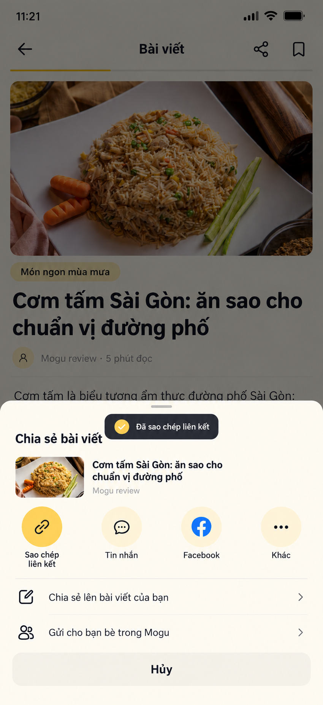

- Share icon mở native share sheet hoặc custom sheet trên; luôn dùng canonical `shareUrl`.
- `Sao chép liên kết` phản hồi bằng toast `Đã sao chép liên kết`; không đóng sheet bắt buộc.
- `Tin nhắn/Facebook/Khác` là adapter theo platform. Nếu app/platform không khả dụng thì ẩn, không để nút vô hiệu khó hiểu.
- `Chia sẻ lên bài viết của bạn` tạo composer với article attachment, không sao chép toàn bộ nội dung bài.
- `Gửi cho bạn bè trong Mogu` chỉ hiển thị sau khi có messaging API; nếu chưa có thì dùng native share và copy link.

#### Interaction contract

```ts
type ArticleEngagement = {
  articleId: string;
  engagementTargetId: string;
  likeCount: number;
  commentCount: number;
  shareCount: number;
  isLiked: boolean;
  isSaved: boolean;
  commentsEnabled: boolean;
  shareUrl: string;
  viewerCapabilities: {
    canLike: boolean;
    canComment: boolean;
    canShare: boolean;
    canSave: boolean;
    canModerateComments: boolean;
  };
};
```

API tối thiểu nếu tiếp tục dùng article endpoints:

```text
PUT    /v1/articles/:id/likes/me
DELETE /v1/articles/:id/likes/me
GET    /v1/articles/:id/comments?sort=relevant|newest&cursor=&limit=
POST   /v1/articles/:id/comments
       { content, parentCommentId? }
PUT    /v1/articles/:id/comments/:commentId/likes/me
DELETE /v1/articles/:id/comments/:commentId/likes/me
DELETE /v1/articles/:id/comments/:commentId
POST   /v1/articles/:id/share-events
       { channel: COPY_LINK|NATIVE|FACEBOOK|MOGU_POST|MOGU_MESSAGE }
```

Response mutation phải trả state/count canonical, ví dụ `{isLiked:true,likeCount:129}`. FE optimistic update và rollback khi lỗi; topic feed, `Dành cho bạn` và reader cùng cache key cho engagement target.

#### Trạng thái cần thiết kế/implement

- Chưa có comment: message ngắn `Chưa có bình luận · Hãy bắt đầu cuộc trò chuyện`, composer vẫn hiện.
- Comments loading: skeleton đúng chiều cao item; pagination dùng footer loader, không block toàn màn.
- Gửi thất bại: giữ text, đánh dấu lỗi gần comment/composer và có `Thử lại`.
- Comment đã xóa: remove nếu không có replies; nếu có replies, thay content bằng `Bình luận đã bị xóa` để giữ thread.
- Comments disabled: ẩn composer, giữ count/list cũ và giải thích `Bình luận đã bị tắt`.
- Like offline: có thể optimistic nhưng phải queue/reconcile; không tăng count lặp khi retry.

#### Acceptance criteria social article

1. Like state/count đồng bộ ở topic feed, `Dành cho bạn` và reader sau refresh/back navigation.
2. Comment mới xuất hiện một lần, tăng count canonical; retry không tạo duplicate.
3. Reply gửi đúng `parentCommentId`, hiển thị đúng root thread và có thể hủy reply target.
4. Share copy dùng canonical URL, có feedback; share count chỉ tăng theo rule server, không tăng mỗi lần mở sheet.
5. Composer không che comment cuối, hoạt động với keyboard/safe area và giữ draft khi request lỗi.
6. Các action có target ≥44pt, label accessibility và trạng thái selected/disabled rõ ràng.
