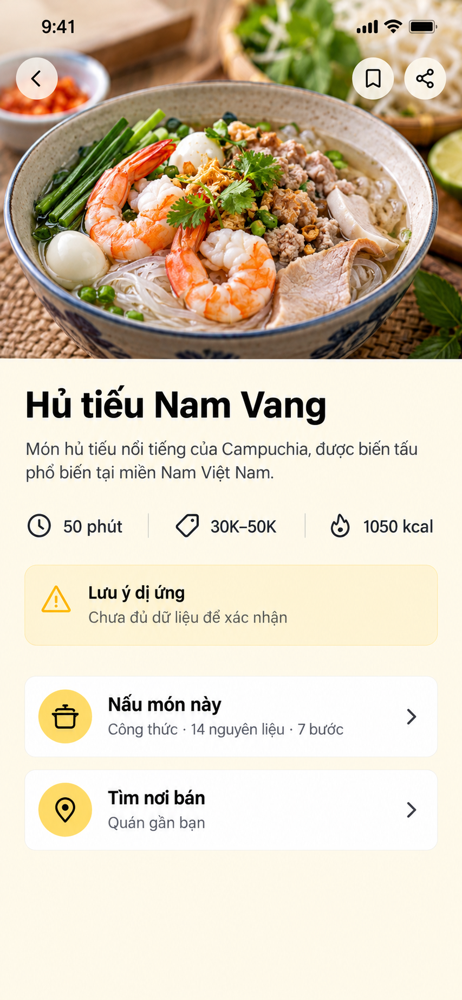
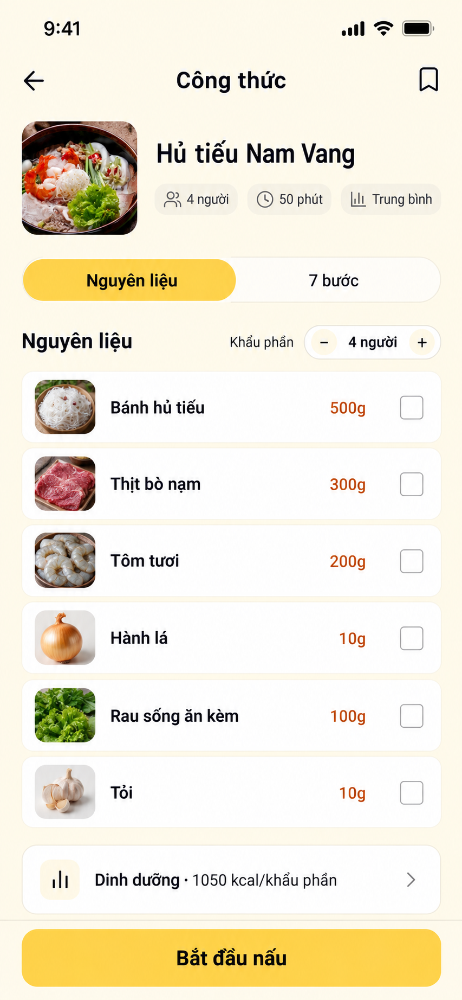
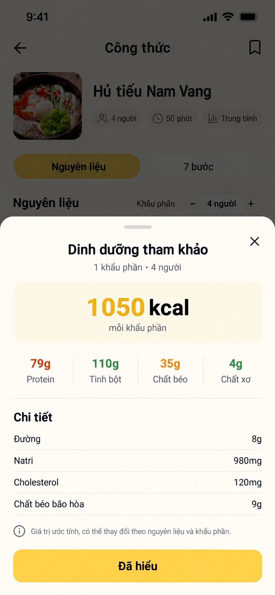
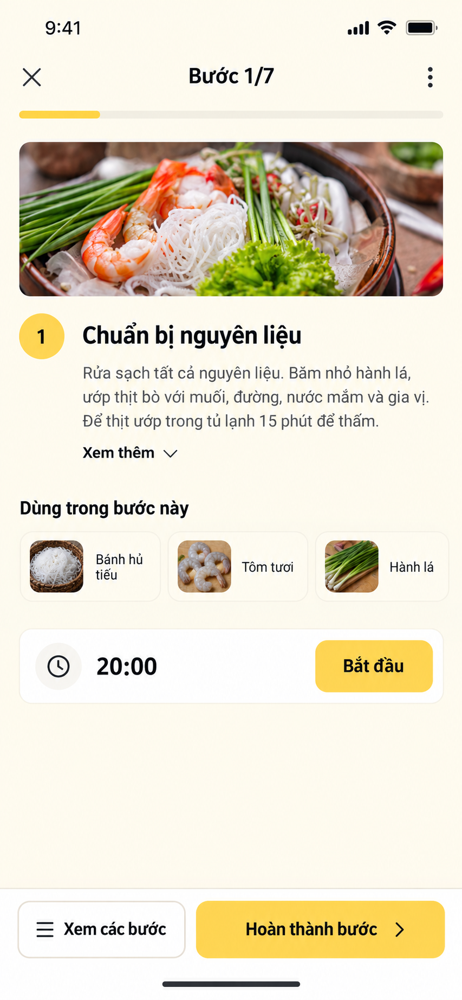
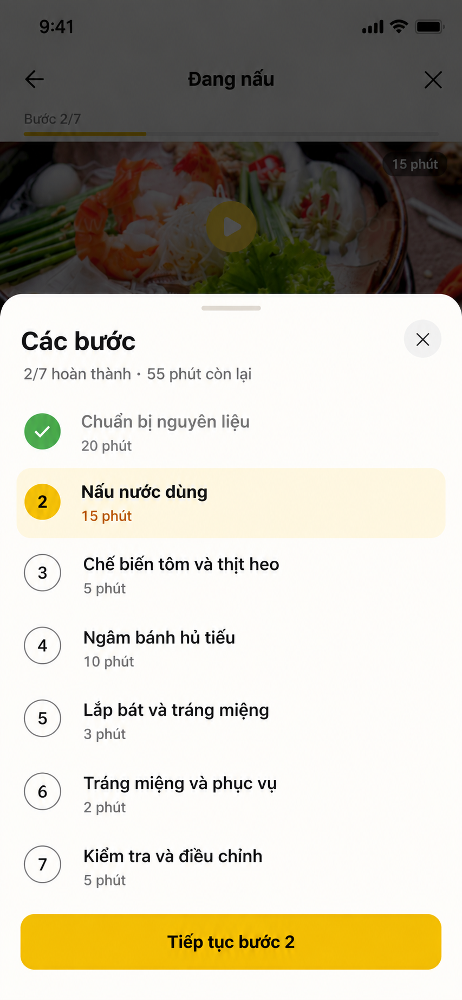
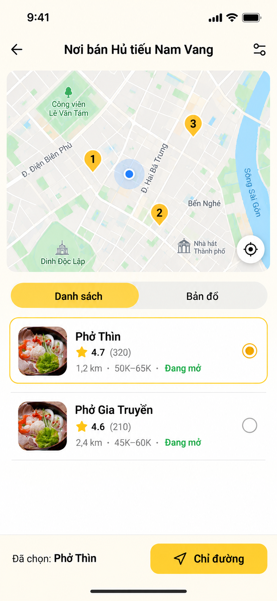

# Thiết kế lại luồng Chi tiết món ăn trên mobile — V2

Ngày: 17/09/2026. Phạm vi: đọc lại 7 ảnh giao diện và đúng luồng người dùng xác nhận; đối chiếu `mobile/src/screens/FoodDetailFlowScreen.tsx`, `FoodDetailScreen.tsx`, `mobile/src/services/api/dishes.ts` và `types.ts`. Đây là đặc tả UX + concept UI, **chưa thay đổi code mobile**.

## Kết luận

Giữ nguyên đúng hai nhánh điều hướng:

```text
Chi tiết món
  ├─ Nấu món này → Công thức (nguyên liệu + các bước trong một màn cuộn)
  │                  → Bắt đầu nấu → Đang nấu
  │                                      └─ Xem các bước → Bottom sheet
  └─ Tìm nơi bán → Địa điểm gần bạn (map + danh sách trong một màn cuộn)
```

Không tạo thêm màn “Chuẩn bị”. Vấn đề của thiết kế hiện tại không phải thiếu màn, mà là **mỗi viewport đang hiển thị quá nhiều nhóm thông tin cùng mức ưu tiên**. Bản V2 giảm tải theo ba quy tắc:

1. Màn đầu chỉ giúp chọn `Nấu món này` hoặc `Tìm nơi bán`.
2. Màn công thức vẫn là một màn dài, nhưng dùng neo `Nguyên liệu / 7 bước`; mỗi viewport chỉ tập trung một nhóm.
3. Màn địa điểm chỉ phục vụ chọn quán và chỉ đường; review cộng đồng và món tương tự không chen vào quyết định này.

## Concept UI V2

### Màn 1 — Chi tiết món



### Màn 2 — Công thức, cùng một màn cuộn cho nguyên liệu và các bước



### Trạng thái khi chạm “Dinh dưỡng”



### Màn 3 — Đang nấu



### Màn 4 — Bottom sheet xem các bước



### Màn 5 — Địa điểm gần bạn, một màn cuộn



Năm ảnh là **concept tạo bằng built-in ImageGen**, không phải screenshot đã triển khai. Ảnh món, bản đồ, quán, rating, giá và khoảng cách là dữ liệu minh hoạ. Khi xây thật phải dùng asset và dữ liệu thật; không cắt UI trực tiếp từ ảnh concept.

## Vì sao bản cũ vẫn gây rối

### Màn chi tiết hiện tại

- Badge `Phù hợp 73%`, rating, mô tả, bữa, giá, thời gian, kcal, cảnh báo, carousel thành phần và hai card điều hướng cùng xuất hiện trong một viewport.
- `Thông tin nhanh` tạo thêm một lớp card nhưng phần lớn lặp dữ liệu đã có ở hàng metadata.
- Carousel thành phần chính chưa giúp người dùng quyết định nên nấu hay đi ăn; tên còn bị cắt.
- Hai hành động chính bị đặt thấp và có hình thức giống card thông tin, nên “đọc” và “hành động” không tách bạch.

### Màn công thức hiện tại

- Nutrition dashboard được ưu tiên trước nguyên liệu dù nhiệm vụ phổ biến là kiểm tra “có gì/cần mua gì”.
- Grid 3 cột tạo 14–15 card nhỏ, tên và lượng bị tách, buộc người dùng quét theo cả hàng lẫn cột.
- Checklist bước đặt bên dưới ingredient grid rất dài; người dùng phải cuộn nhiều mới biết công thức có bao nhiêu bước và độ phức tạp ra sao.
- Video giả dùng ảnh món + nút play dù chưa có video URL thật.

### Màn đang nấu và sheet hiện tại

- Ảnh/video chiếm nhiều chiều cao; instruction, mẹo, 5+ nguyên liệu và timer dồn vào phần còn lại.
- Bước hiện tại được trình bày như một trang chi tiết đầy đủ thay vì “một việc cần làm lúc này”.
- Danh sách bước chưa tạo khác biệt đủ rõ giữa `đã xong`, `đang làm`, `chưa làm` và chưa có tóm tắt tiến độ.

### Màn địa điểm hiện tại

- Map, quán, review dài, viết đánh giá và món tương tự nằm trong cùng một trang; mục tiêu “chọn quán” bị loãng.
- Nút `Chỉ đường đến quán` xuất hiện dù người dùng chưa chọn rõ quán nào.
- Dữ liệu quán, pin, review và món tương tự hiện được hard-code trong `LocationPage`; giao diện nhìn như dữ liệu thật nhưng không có provenance.

## Tham khảo và bài học áp dụng

- [Kitchen Stories trên Google Play](https://play.google.com/store/apps/details?id=com.ajnsnewmedia.kitchenstories) mô tả cooking mode theo từng bước, timer theo bước và thay đổi lượng nguyên liệu theo khẩu phần. Áp dụng: màn công thức dùng khẩu phần + danh sách nguyên liệu; màn đang nấu chỉ tập trung một bước và timer liên quan.
- [Kitchen Stories — Shopping List](https://www.kitchenstories.com/en/stories/the-shopping-list-is-back) cho phép lượng nguyên liệu thay đổi theo khẩu phần và tick món đã có. Áp dụng: danh sách một cột với checkbox rõ nghĩa, không dùng grid card trang trí.
- [Samsung Food](https://www.samsung.com/us/home-appliances/samsung-food/) tách cookbook, cooking, planning và shopping thành những nhiệm vụ khác nhau. Áp dụng: chi tiết món là điểm rẽ; cooking và nearby không trộn nội dung.
- [Tasty Recipes](https://tasty.recipes/) đặt tìm món/nguyên liệu và nấu từng bước làm trọng tâm. Áp dụng: metadata và an toàn hiển thị trước lựa chọn, nội dung phụ đưa xuống tầng sau.
- [Google Maps Help — thông tin địa điểm](https://support.google.com/maps/answer/7566112) mô tả pattern chọn một địa điểm trên map/list rồi xem giờ mở cửa, rating/review và lấy chỉ đường. Áp dụng: pin có số tương ứng danh sách, chọn quán trước rồi mới bật CTA chỉ đường.
- [Google Maps Help — local results](https://support.google.com/maps/answer/4610185) nêu kết quả gần đây dựa chủ yếu vào relevance, distance và prominence. Áp dụng: Mogu phải nói rõ tiêu chí xếp hạng, không gọi quán đầu tiên là “phù hợp nhất” nếu chỉ sắp theo khoảng cách.
- [Nielsen Norman Group — Progressive Disclosure](https://www.nngroup.com/articles/progressive-disclosure/) khuyên đưa tác vụ quan trọng lên trước và để chi tiết ít dùng ở tầng sau có nhãn rõ. Áp dụng: không ẩn dị ứng/thời gian; thu gọn macro, review đầy đủ và thông tin phụ.

Đây là tham khảo pattern, không phải bằng chứng rằng thiết kế chắc chắn tối ưu cho Mogu. Cần usability test với người dùng Việt Nam và dữ liệu analytics thật.

## Màn 1 — Chi tiết món

### Câu hỏi màn này phải trả lời

`Đây là món gì, có lưu ý gì, và tôi muốn tự nấu hay tìm nơi bán?`

### Cấu trúc đề xuất

1. Hero ảnh 16:9, nút back/save/share nằm trên ảnh hoặc header trong suốt.
2. Tên món + mô tả tối đa 2 dòng. `Xem thêm` chỉ xuất hiện nếu nội dung thật sự dài.
3. Một hàng metadata duy nhất: `50 phút · 30K–50K · 1050 kcal`.
4. Một hàng trạng thái dị ứng nhỏ nhưng dễ thấy.
5. Hai action rows lớn:
   - `Nấu món này` — phụ đề `Công thức · 14 nguyên liệu · 7 bước`.
   - `Tìm nơi bán` — phụ đề `3 quán gần bạn`, chỉ khi có API thật; nếu chưa tải thì `Xem quán gần bạn`.

### Loại bỏ khỏi màn đầu

- `Phù hợp 73%` cho tới khi score được định nghĩa và hiệu chuẩn.
- Card `Thông tin nhanh` vì lặp metadata.
- Carousel thành phần chính; nguyên liệu thuộc màn công thức.
- Rating nếu món chưa có review thật.
- Sticky CTA: màn này có hai ý định ngang cấp, nên hai action rows là đủ.

### Hành vi

- Chạm toàn bộ row, không chỉ chevron. Target ≥44pt iOS/48dp Android.
- Save gọi API và rollback khi lỗi; share dùng native share/deep link.
- Dị ứng có ba trạng thái: `Có chứa`, `Không phát hiện trong dữ liệu đã kiểm tra`, `Chưa đủ dữ liệu để xác nhận`. Không suy ra an toàn từ mảng rỗng.

## Màn 2 — Công thức (hình 2 + hình 3 là một màn)

### Câu hỏi màn này phải trả lời

`Tôi cần gì, làm bao nhiêu phần, và công thức có những bước nào?`

### Điều hướng trong cùng một màn

Dùng segmented anchor sticky ngay dưới dish summary:

- `Nguyên liệu` → scroll tới đầu section nguyên liệu.
- `7 bước` → scroll tới đầu section cách chế biến.
- Khi cuộn, selected state cập nhật theo section đang thấy.
- Đây không phải hai màn/tab giữ state riêng; chỉ là neo trong cùng `ScrollView`.

### Section đầu trang và nguyên liệu

- Header `Công thức`, save icon.
- Dish summary compact: thumbnail 72–80dp, tên món, `4 người · 50 phút · Trung bình`.
- Serving stepper dùng `recipeBaseServings` thật.
- Danh sách một cột: thumbnail 44–48dp, tên đầy đủ, quantity + unit và checkbox `Đã có`.
- Nhóm nguyên liệu bằng heading khi có group: `Nước dùng`, `Topping`, `Ăn kèm`; không biến từng item thành card nổi.
- Dinh dưỡng là disclosure một hàng: `Dinh dưỡng · 1050 kcal/khẩu phần`; mở sheet/accordion khi cần macro.

### Section các bước ở phần dưới cùng màn

- Mỗi bước chỉ có số, title và duration. Không hiển thị toàn instruction ở overview.
- Có summary `7 bước · khoảng 50 phút`.
- Video chỉ hiện khi có `videoUrl`; nếu không có thì bỏ cả section, không dùng ảnh món giả video.
- Sticky CTA `Bắt đầu nấu` luôn dẫn tới bước 1; nội dung cuối có padding để không bị footer che.
- Checkbox nguyên liệu chỉ có nghĩa `Tôi đã có`, không phải progress nấu.

### Khi chạm “Dinh dưỡng”

- Mở bottom sheet trên chính màn Công thức, không điều hướng sang trang mới và không làm mất vị trí cuộn/nguyên liệu đã tick.
- Header: `Dinh dưỡng tham khảo`, close và ngữ cảnh `1 khẩu phần · 4 người`.
- Thứ tự ưu tiên: tổng năng lượng → bốn macro → chi tiết bổ sung → disclaimer.
- Tổng năng lượng dùng một vùng nhấn duy nhất: `1050 kcal · mỗi khẩu phần`.
- Bốn macro hiển thị cùng một hàng, không biến thành bốn card: `Protein`, `Tinh bột`, `Chất béo`, `Chất xơ`.
- Chi tiết bổ sung dùng danh sách hai cột, chỉ render field backend thực sự có: đường, natri, cholesterol, chất béo bão hòa. Field thiếu được ẩn, không điền `0`.
- Không dùng biểu đồ tròn, “health score”, phần trăm nhu cầu mỗi ngày hoặc màu xanh/đỏ để phán xét món nếu chưa có mục tiêu dinh dưỡng cá nhân và quy tắc đã được chuyên gia xác nhận.
- Disclaimer luôn thấy: `Giá trị ước tính, có thể thay đổi theo nguyên liệu và khẩu phần.`
- `Đã hiểu`, nút X, tap scrim, swipe down và Back Android đều đóng sheet rồi trả focus về row `Dinh dưỡng`.
- Khi đổi khẩu phần ở màn Công thức, sheet vẫn ghi rõ giá trị **trên mỗi khẩu phần**; không nhân kcal/macro theo tổng số người. Nếu product muốn hiển thị tổng mẻ nấu, cần một toggle có nhãn rõ `Mỗi khẩu phần / Tổng công thức`.

## Màn 3 — Đang nấu

### Câu hỏi màn này phải trả lời

`Ngay bây giờ tôi cần làm gì?`

### Cấu trúc đề xuất

1. Header: close, `Bước 1/7`, menu; progress bar mỏng.
2. Ảnh bước tỉ lệ thấp hơn hiện tại. Chỉ dùng media của đúng bước; nếu không có, bỏ media.
3. Số bước + title; instruction tối đa khoảng 4 dòng, `Xem thêm` mở đầy đủ inline.
4. `Dùng trong bước này`: tối đa 3 item thấy ngay; nếu nhiều hơn dùng `+2`.
5. Timer chỉ xuất hiện nếu step có duration; card phẳng với `20:00` và `Bắt đầu`.
6. Footer: `Xem các bước` secondary, `Hoàn thành bước` primary.

### Timer và hoàn thành bước

- Lưu `endsAt`, không chỉ decrement state mỗi giây; khôi phục đúng khi app background/lock.
- Timer không auto-start. Chuyển bước khi timer còn chạy phải xác định giữ hay dừng.
- Tap hoàn thành đổi state rồi chuyển sang bước kế; bước cuối đổi thành `Hoàn tất món ăn`.
- Animation 150–250ms và hỗ trợ reduced motion.

## Màn 4 — Bottom sheet “Các bước”

- Title `Các bước`, close, drag handle.
- Summary `2/7 hoàn thành · 55 phút còn lại` chỉ khi duration đủ dữ liệu.
- Completed: check icon + text giảm emphasis.
- Current: số bước + nền vàng nhạt + accessibility label `Bước hiện tại`.
- Upcoming: số outline + neutral.
- Row chỉ có title và duration; tap row chuyển bước. Bỏ qua bước chưa làm cần xác nhận ngắn.
- Sheet cao 60–75%, nội dung cuộn trong sheet, footer/safe area cố định.
- Scrim đủ tách foreground; background không tương tác và focus nằm trong sheet.

## Màn 5 — Địa điểm gần bạn (hình 6 + hình 7 là một màn)

### Câu hỏi màn này phải trả lời

`Quán nào có khả năng bán món này, ở đâu, và tôi chọn quán nào để đi?`

### Cấu trúc đề xuất

1. Header `Nơi bán Hủ tiếu Nam Vang`, filter.
2. Map cao 28–32% viewport, user location + pin đánh số tương ứng list.
3. Segmented control `Danh sách / Bản đồ`: list giữ map compact; map mode mở rộng map + selected-place preview.
4. Row quán: thumbnail, tên, rating + count, distance, price, open status và radio/select state.
5. Footer chỉ active sau khi chọn: `Đã chọn: Phở Thìn` + `Chỉ đường`.

### Loại bỏ khỏi màn địa điểm

- Card món lặp lại ở đầu; tên món đã nằm trong header.
- Vòng tròn bán kính giả; dùng map thật và filter khoảng cách.
- Review cộng đồng dài, `Viết đánh giá`, món tương tự.
- CTA chỉ đường khi chưa có selected place.

Nếu vẫn cần review: rating + số review ở row đủ so sánh nhanh; tap quán mở màn `Chi tiết quán`, review đầy đủ nằm ở đó. `Món tương tự` thuộc detail/discovery, không thuộc nearby.

### Quyền vị trí và dữ liệu

- Chưa cấp quyền: cho chọn khu vực, banner nhỏ `Bật vị trí để xem khoảng cách`; không chặn màn.
- Không có quán: `Chưa tìm thấy nơi bán món này gần bạn` + `Mở rộng bán kính`.
- Nếu chỉ tìm theo text, ghi `Có thể có món này`; không khẳng định menu.

## Quy tắc giảm tải nội dung

| Màn | Luôn thấy | Ẩn/thu gọn | Loại bỏ |
|---|---|---|---|
| Chi tiết | ảnh, tên, 3 metadata, dị ứng, 2 lựa chọn | mô tả dài | ingredient carousel, quick-info, score % |
| Công thức | summary, anchor, section đang đọc, CTA | macro, note dài | nutrition dashboard lớn, video giả |
| Đang nấu | current step, instruction, 3 ingredients, timer | instruction đầy đủ | nội dung bước khác |
| Steps sheet | progress, state từng bước | chi tiết instruction | ảnh/video/nguyên liệu |
| Nearby | map, quán, select state | filter nâng cao | review feed, món tương tự |

## Dữ liệu/API cần có

- `DishDetail`: `description`, `imageUrl`, `priceMin/priceMax`, `prepMinutes/cookMinutes`, `nutritionPerServing`, `allergenAssessment`, `recipeSummary`, `isSaved`.
- `Recipe`: `baseServings`, `difficulty`, `ingredients[]`, `steps[]`, optional `videoUrl`.
- `Ingredient`: `id`, `displayName`, `quantity`, `unit`, `note`, `group`, `imageUrl`, `isOptional`; không parse số lượng quan trọng từ `rawText`.
- `RecipeStep`: `id`, `order`, `title`, `instruction`, `durationMin`, `ingredientIds`, `imageUrl/videoUrl`.
- `NearbyPlace`: `placeId`, `name`, `coordinates`, `distanceMeters`, `rating`, `ratingCount`, `priceRange`, `openStatus`, `imageUrl`, `menuMatchStatus`, `directionsDeepLink`.
- Nearby API phải trả provenance/ranking hoặc sort mode. Không hard-code pin/quán/review.
- `allergenAssessment.status`: `CONTAINS|NOT_DETECTED|UNKNOWN`; `allergens: []` không đủ để suy ra an toàn.

## Visual system

- Giữ cream + Mogu yellow; vàng chỉ cho CTA, active anchor/current step và selected place.
- Surface chủ yếu phẳng; card chỉ cho decision row, timer và selected state. Không tạo 8–15 card nổi/màn.
- Gutter 16dp; section gap 24dp; row 56–72dp; radius 12–16dp; divider thay shadow cho list.
- Title 24–30sp; section 18–20sp; body 16sp/line-height 23–25; metadata ≥14sp.
- Một icon family vector; không emoji làm icon/fallback cấu trúc.
- Touch target ≥44pt iOS/48dp Android, gap control ≥8dp, press feedback 80–150ms.
- Text contrast ≥4.5:1; meaningful icon/border ≥3:1. Dynamic Type không cắt title, quantity hoặc CTA.

## Trạng thái bắt buộc

- Skeleton giữ đúng chiều cao media/list để tránh layout jump.
- Không hiện fallback giá/thời gian/độ khó giả.
- Recipe không có steps: ẩn/disable `Nấu món này`, giải thích `Chưa có công thức`.
- Ingredient không scale được: giữ `vừa đủ/theo khẩu vị`.
- Offline giữa cooking: recipe và progress dùng local cache; đồng bộ sau.
- Nearby có loading/error/empty/permission-denied riêng.
- Video chỉ render khi có URL phát được.

## Kiểm thử trước khi triển khai rộng

- Từ detail chọn đúng nhánh nấu hoặc tìm quán mà không cần giải thích.
- Trên recipe tìm lượng tôm cho 6 người và nhảy tới `7 bước`.
- Trong cooking bắt đầu timer, mở sheet, quay lại bước hiện tại.
- Trên nearby chọn quán thứ hai rồi lấy chỉ đường.
- Đo time-on-task, mis-tap, backtrack, scroll depth, start-cooking rate và directions rate.
- Test 375px, font 200%, landscape, TalkBack/VoiceOver, reduced motion, dark mode, mạng chậm/offline và timer qua background.

## Thứ tự triển khai

1. **P0:** sửa hierarchy đúng luồng; bỏ dữ liệu hard-code khỏi production.
2. **P0:** detail V2, recipe anchor + list một cột, cooking focused step, steps sheet state rõ.
3. **P1:** contract structured servings/ingredients/steps, timer bền qua background.
4. **P1:** nearby select-place flow và chỉ đường thật.
5. **P2:** chi tiết quán/review riêng nếu cần; không đưa lại vào nearby list.

## Prompt set tạo mockup V2

Built-in ImageGen, taxonomy `ui-mockup`, năm prompt riêng: (1) detail chỉ giữ hero, title, metadata, dị ứng và hai action; (2) recipe một màn cuộn, anchor `Nguyên liệu/7 bước`, ingredient list một cột và nutrition collapsed; (3) cooking một current step, 3 ingredients, timer và footer; (4) bottom sheet có completed/current/upcoming; (5) nearby có map numbered pins, list selectable và CTA sau khi chọn. Tất cả dùng cream/yellow, ít card/shadow, không mascot, emoji cấu trúc, fake score, fake review hoặc fake video.
