# Thiết kế lại Nhật ký bữa ăn mobile

Ngày: 23/09/2026. Phạm vi: bốn chế độ Ngày, Tuần, Tháng, Năm dựa trên giao diện hiện tại. Đây là concept và UX handoff, chưa thay đổi code production.

## Mục tiêu

- Một cấu trúc nhất quán cho cả bốn kỳ, nhưng mỗi kỳ ưu tiên đúng loại thông tin người dùng cần.
- Giảm số card, badge và chữ bị lặp.
- Làm rõ số liệu tổng, mục tiêu và macro; không hiển thị placeholder khó hiểu như `/ – kcal`.
- Không lặp toàn bộ danh sách từng bữa ở màn Tháng/Năm.
- Biểu đồ phải giải thích được dữ liệu thiếu và không dựa vào màu đơn thuần.

## Concept được chọn

### Ngày

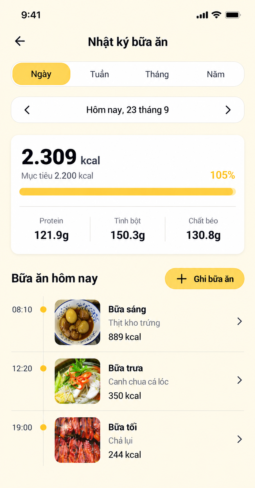

- Segmented control duy nhất `Ngày / Tuần / Tháng / Năm`.
- Summary một card: kcal đã ghi, mục tiêu, phần trăm và ba macro.
- Danh sách trở thành timeline theo giờ, không dùng một card shadow cho mỗi món.
- Chỉ hiển thị badge trạng thái khi có ý nghĩa. Không lặp `Kế hoạch` ở mọi hàng.
- `+ Ghi bữa ăn` là action rõ ràng; tap meal row mở meal-log detail.

### Tuần

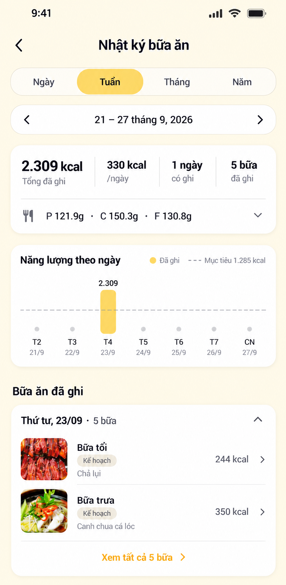

- Summary ưu tiên tổng kcal, trung bình/ngày, số ngày có ghi và số bữa.
- Macro được thu gọn thành một hàng có thể expand.
- Chart chỉ dùng chiều cao vừa đủ; ngày không có dữ liệu là dot baseline, không phải cột 0 gây nhầm với ăn 0 kcal.
- Meals được group theo ngày. Date chỉ xuất hiện một lần ở group header.
- Mặc định preview hai bữa; `Xem tất cả 5 bữa` expand hoặc mở day detail.

### Tháng

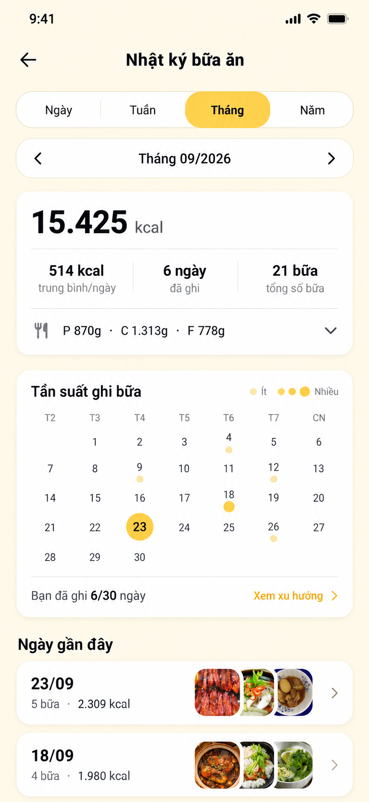

- Thay danh sách bữa lặp bằng calendar heatmap `Tần suất ghi bữa`.
- Kích thước/intensity của dot thể hiện số bữa; luôn có legend `Ít → Nhiều`.
- Tap ngày có dữ liệu mở day detail. Ngày đang chọn có circle và focus state riêng.
- `Ngày gần đây` hiển thị tổng theo ngày và thumbnail stack, không liệt kê từng meal.
- Dòng `Bạn đã ghi 6/30 ngày` giúp hiểu coverage, tránh diễn giải sai trung bình tháng.

### Năm

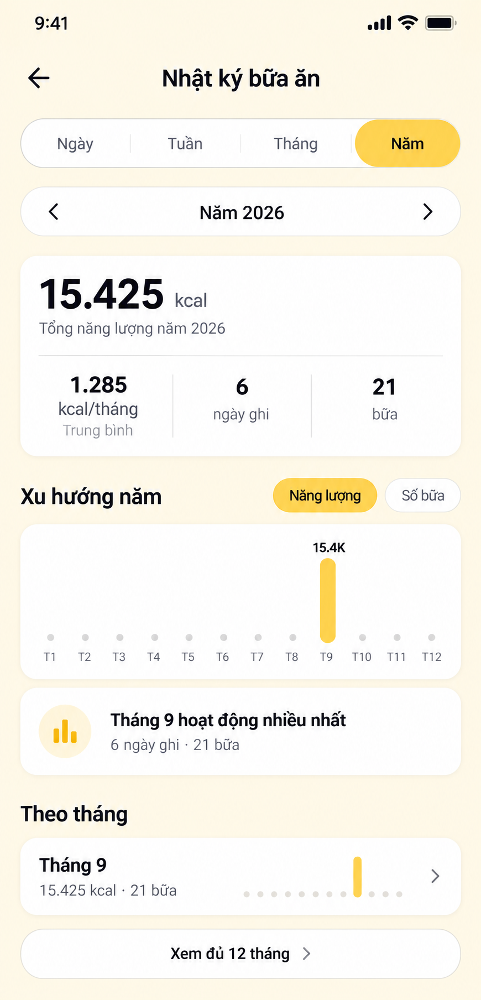

- Không hiển thị meal card riêng lẻ.
- Chart 12 tháng có toggle `Năng lượng / Số bữa`; tháng thiếu dữ liệu là dot.
- Insight chỉ nêu một kết luận dễ hiểu: tháng hoạt động nhiều nhất.
- Section `Theo tháng` dùng row tổng hợp; mặc định chỉ hiện tháng có dữ liệu, có action xem đủ 12 tháng.

## Kiến trúc component

```text
MealJournalScreen
 ├─ PeriodSegmentedControl
 ├─ PeriodNavigator
 ├─ JournalSummaryCard
 │   ├─ EnergySummary
 │   └─ MacroSummary
 └─ PeriodContent
     ├─ DayMealTimeline
     ├─ WeeklyEnergyChart + DateMealGroups
     ├─ MonthlyMealHeatmap + RecentDays
     └─ YearlyTrendChart + MonthRows
```

- Giữ nguyên scroll position riêng cho từng tab trong phiên.
- Swipe giữa kỳ là shortcut; luôn giữ arrow button ≥44pt để không phụ thuộc gesture.
- Tap lại tab đang chọn không reset về hiện tại. Có action `Hôm nay` khi user điều hướng sang kỳ cũ.
- Period label là button mở date/week/month/year picker tương ứng.

## Quy tắc hiển thị số liệu

- `consumedKcal` là kcal từ các meal log hợp lệ trong range, không cộng meal kế hoạch chưa ăn.
- Mục tiêu chỉ hiện khi có target thật. Nếu không có, ẩn progress và hiển thị `Chưa đặt mục tiêu` kèm action.
- Nếu vượt mục tiêu, thanh vẫn dừng ở 100% về chiều dài; label có thể hiện `105%`, không tràn khỏi track.
- Trung bình luôn kèm mẫu số rõ: theo calendar days, active days hay months. Khuyến nghị dùng active days và ghi `/ngày có ghi` trong tooltip/accessibility.
- Dữ liệu không có khác với giá trị 0: null dùng dot/empty state; 0 chỉ dùng khi người dùng thực sự ghi giá trị bằng 0.
- Decimal macro dùng locale Việt Nam khi production quyết định chuẩn format; mockup giữ dữ liệu hiện tại để đối chiếu.

## API contract đề xuất

```ts
type MealJournalRange = {
  period: 'DAY' | 'WEEK' | 'MONTH' | 'YEAR';
  range: { start: string; end: string; timezone: string };
  summary: {
    consumedKcal: number;
    targetKcal?: number;
    activeDays: number;
    mealCount: number;
    proteinG: number;
    carbsG: number;
    fatG: number;
  };
  series: Array<{
    key: string;
    date?: string;
    month?: number;
    consumedKcal: number | null;
    mealCount: number;
  }>;
  dayGroups?: Array<{
    localDate: string;
    consumedKcal: number;
    mealCount: number;
    previewMediaUrls: string[];
    meals?: MealLogPreview[];
  }>;
};
```

```text
GET /v1/health/meal-journal?period=DAY&anchor=2026-09-23&timezone=Asia/Ho_Chi_Minh
GET /v1/health/meal-journal?period=WEEK&anchor=2026-09-23&timezone=Asia/Ho_Chi_Minh
GET /v1/health/meal-journal?period=MONTH&anchor=2026-09-01&timezone=Asia/Ho_Chi_Minh
GET /v1/health/meal-journal?period=YEAR&anchor=2026-01-01&timezone=Asia/Ho_Chi_Minh
```

- Server trả range canonical để FE không tự tính sai tuần/timezone.
- Day response trả đầy đủ meals. Week chỉ cần meals của group được expand hoặc preview giới hạn.
- Month/Year trả aggregate + preview; fetch day/month detail khi user drill down.
- Mỗi meal preview cần `id, mealSlot, loggedAt, title, thumbnailUrl, calories, sourceType, status`.
- Response nên có `generatedAt`/ETag; mutation meal log invalidate các range chứa local date đó.

## Empty, loading và error

- Loading dùng skeleton đúng kích thước summary/chart/list; giữ layout ổn định.
- Day empty: `Chưa ghi bữa ăn hôm nay` + `Ghi bữa ăn`.
- Week/Month/Year empty: không vẽ chart giả; message `Chưa có dữ liệu trong khoảng này`.
- Partial data: chart vẫn hiển thị, đánh dấu ngày/tháng thiếu; không nội suy.
- Error giữ dữ liệu cache gần nhất và đặt `Không thể cập nhật · Thử lại` gần section lỗi.
- Ảnh meal lỗi dùng thumbnail fallback nhỏ; không làm row cao hoặc biến mất.

## Accessibility và chart

- Segment announce role tab và selected state.
- Arrow có label đầy đủ, ví dụ `Tuần trước`, không chỉ `Mũi tên trái`.
- Chart có text summary cho screen reader: `Tuần 21–27/9, chỉ ngày 23/9 có 2.309 kcal`.
- Không dùng yellow duy nhất để truyền đạt: selected có shape/label; chart có value/legend.
- Touch target ≥44pt iOS/48dp Android; Dynamic Type không làm summary bốn cột chồng nhau — chuyển 2×2 nếu cần.
- Meal rows có combined label: slot, món, kcal, thời gian.

## Acceptance criteria

1. Chuyển Ngày/Tuần/Tháng/Năm không tạo bốn màn có cấu trúc khác nhau; header/segmented/navigator ổn định.
2. Day chỉ hiển thị meal timeline; Month/Year không tải và render toàn bộ meal rows.
3. Ngày/tháng không dữ liệu khác rõ với 0 kcal; chart không gây hiểu sai.
4. Tổng kcal, count và macro khớp giữa kỳ cha/con trong cùng timezone.
5. Thay đổi/xóa meal cập nhật Day và invalidate Week/Month/Year liên quan.
6. Summary không có slash/dash placeholder; unit và mẫu số của average rõ ràng.
7. Chart có text alternative, legend và hoạt động với Dynamic Type/reduced motion.
8. Không có floating settings/debug button trong production.

## Prompt tạo concept

Built-in ImageGen, taxonomy `ui-mockup`, bốn prompt riêng cho Day/Week/Month/Year. Tất cả dùng bốn ảnh gốc làm reference, giữ Mogu cream/yellow, hợp nhất segmented control và điều chỉnh nội dung theo đúng mục tiêu của từng kỳ.

---

## V3: đầy đủ interaction cho Tuần, Tháng và Năm

Sau phản hồi, màn Ngày V2 được giữ nguyên. V3 điều chỉnh ba kỳ tổng hợp theo nguyên tắc: **meal history xuất hiện trước hoặc ngang hàng với analytics**, biểu đồ chuyên sâu nằm ở màn phụ, và không tạo màn mới cho thao tác chỉ thay kỳ.

## Tuần V3

### Màn chính

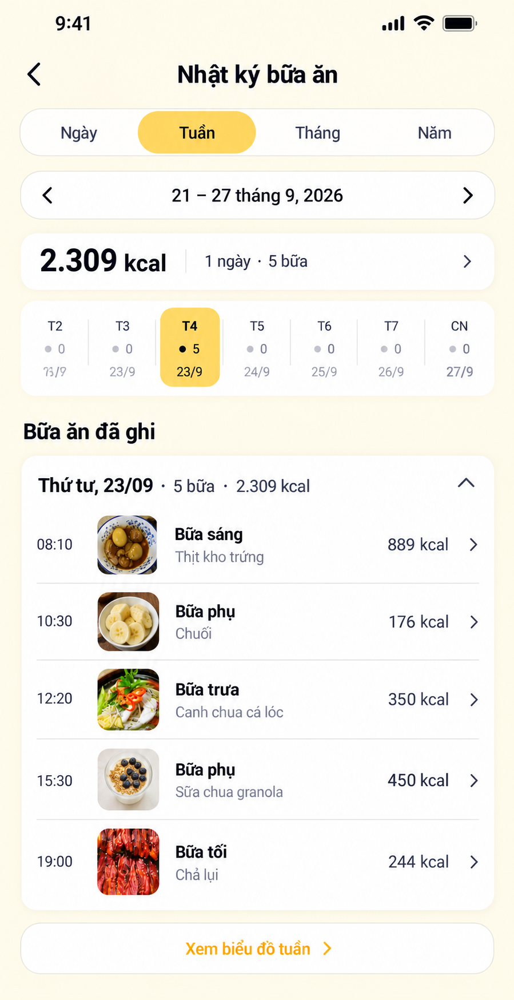

- Bỏ chart lớn khỏi màn chính; thay bằng day selector một hàng. Người dùng nhìn thấy đủ năm bữa ngay trong viewport/scroll đầu.
- Summary chỉ còn `2.309 kcal · 1 ngày · 5 bữa`. Tap summary/chevron mở sheet dinh dưỡng.
- Tap một ngày trong day selector:
  - có dữ liệu: chọn ngày và cập nhật group bữa phía dưới;
  - không có dữ liệu: hiển thị empty inline `Chưa ghi bữa ngày này` + `Ghi bữa ăn`;
  - tap lần nữa vào ngày đang chọn hoặc tap group header: mở màn Ngày V2 đúng date.
- Tap meal row mở Meal Log Detail. Không mở cả group bằng cùng gesture để tránh nhầm.
- `Xem biểu đồ tuần` mở màn Xu hướng tuần.

### Tap summary — Dinh dưỡng tuần

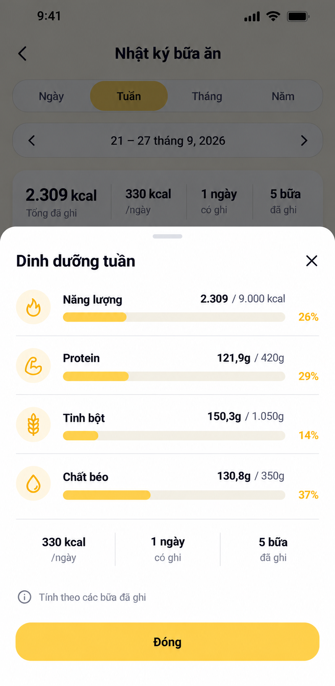

- Bottom sheet cho kcal + macro và target; màn chính không cần chứa chi tiết này.
- Thanh progress có số tuyệt đối và phần trăm. Khi chưa có target, thay denominator bằng `Chưa đặt mục tiêu`, không dùng 0.
- Sheet có drag/close/back Android; `Đóng` là action duy nhất.

### Tap Xem biểu đồ tuần

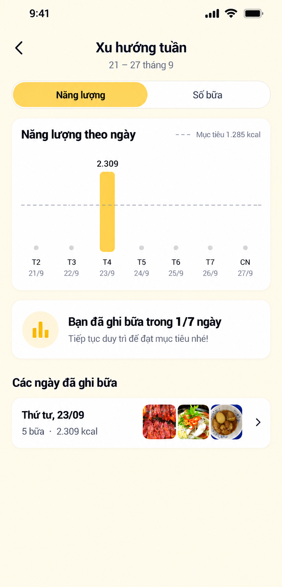

- Toggle `Năng lượng / Số bữa` chỉ đổi metric tại chỗ.
- Tap bar/day hoặc row ngày mở màn Ngày V2.
- Day không có dữ liệu hiển thị dot, không dùng bar 0.
- Insight chỉ một câu; không thêm nhiều paragraph khuyên người dùng.

### Toàn bộ button map — Tuần

- `Ngày/Tháng/Năm` → đổi period trong cùng route, giữ anchor phù hợp.
- Arrow trái/phải → đổi tuần tại chỗ.
- Period label → mở week picker.
- Summary chevron → mở sheet Dinh dưỡng tuần.
- Day selector → chọn group bữa; tap group header để mở Day.
- Group chevron → collapse/expand meal rows.
- Meal row → Meal Log Detail.
- `Xem biểu đồ tuần` → Xu hướng tuần.
- Toggle chart → đổi Năng lượng/Số bữa tại chỗ.

## Tháng V3

### Màn chính

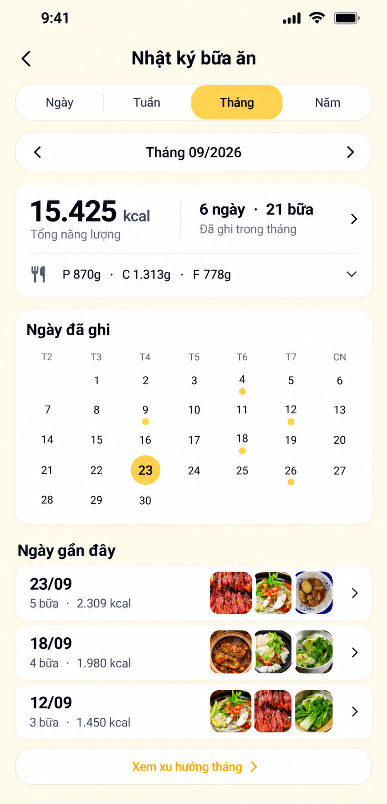

- Summary rút thành một strip; calendar chỉ đánh dấu ngày có ghi, không có legend/chữ giải thích dài.
- `Ngày gần đây` nằm ngay dưới calendar, dùng row date + count + kcal + thumbnail stack.
- Tap date trên calendar hoặc row gần đây đều mở **màn Ngày V2** với date đó. Không tạo thêm kiểu detail khác.
- Tap summary/chevron dùng lại sheet dinh dưỡng với title `Dinh dưỡng tháng`.
- `Xem xu hướng tháng` mở màn analytics riêng.

### Tap Xem xu hướng tháng

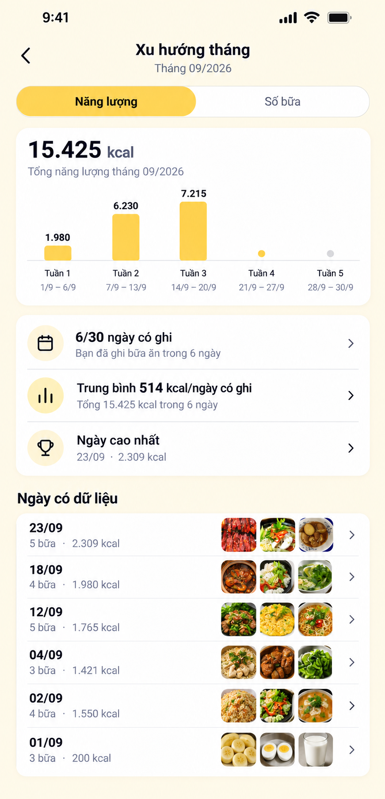

- Chart theo tuần, toggle Năng lượng/Số bữa.
- Ba insight ngắn, không dùng paragraph:
  - coverage ngày có ghi;
  - trung bình trên ngày có ghi;
  - ngày cao nhất.
- Tap insight `Ngày cao nhất` hoặc date row mở Ngày V2.
- Danh sách `Ngày có dữ liệu` chỉ hiện aggregate + thumbnail, không lặp từng meal.

### Toàn bộ button map — Tháng

- Arrow trái/phải → đổi tháng tại chỗ.
- Period label → mở month/year picker.
- Summary chevron → sheet Dinh dưỡng tháng.
- Calendar date có dữ liệu → Day V2.
- Calendar date chưa có dữ liệu → Day V2 empty + Ghi bữa ăn.
- Row Ngày gần đây → Day V2.
- `Xem xu hướng tháng` → màn Xu hướng tháng.
- Toggle chart → đổi Năng lượng/Số bữa.
- Insight/date row → Day V2 đúng date.

## Năm V3

### Màn chính — Năng lượng

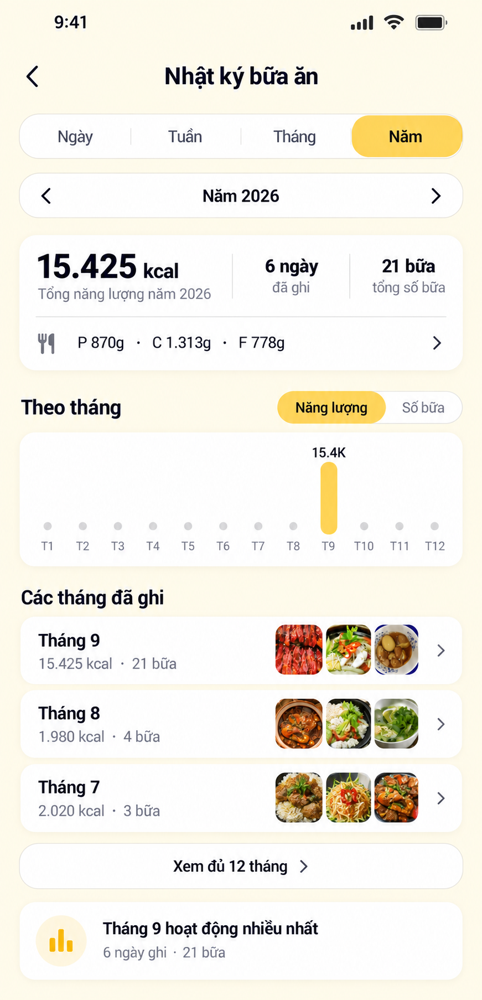

- Month history được đưa lên trước insight dài; chỉ tháng có dữ liệu xuất hiện.
- Tap bar hoặc month row mở màn Tháng V3.
- Summary chevron mở sheet `Dinh dưỡng năm`.

### Tap Số bữa

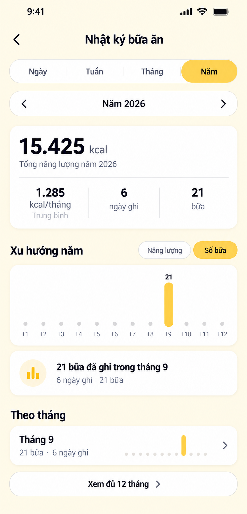

- Chỉ thay metric chart và copy liên quan; summary và month rows giữ vị trí để tránh layout jump.
- T9 hiển thị 21 bữa thay vì kcal. Screen reader announce metric + month + value.

### Tap Xem đủ 12 tháng

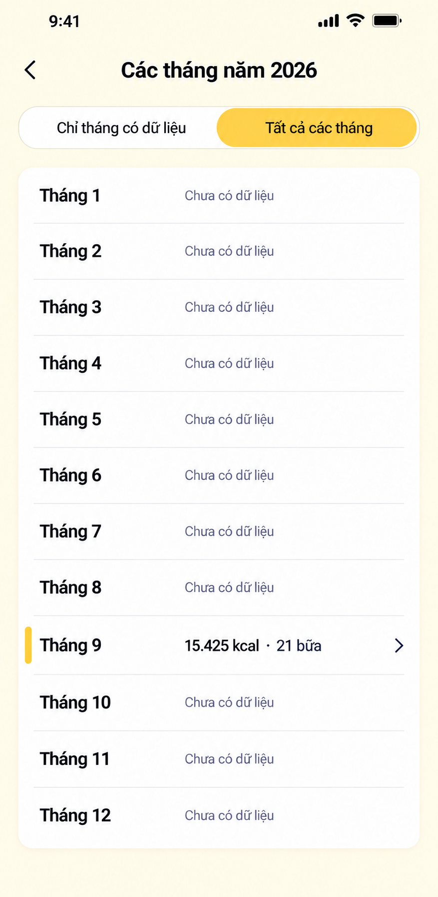

- `Tất cả các tháng`: hiển thị đủ 12; tháng không có data ghi `Chưa có dữ liệu`, không ghi 0.
- `Chỉ tháng có dữ liệu`: lọc list, không gọi route khác.
- Chỉ row có dữ liệu có chevron/tap. Tap Tháng 9 mở màn Tháng V3.

### Toàn bộ button map — Năm

- Arrow trái/phải → đổi năm tại chỗ.
- Period label → mở year picker.
- Summary chevron → sheet Dinh dưỡng năm.
- Năng lượng/Số bữa → đổi metric chart tại chỗ.
- Month bar hoặc month row → Tháng V3.
- `Xem đủ 12 tháng` → màn Các tháng năm YYYY.
- Chỉ có dữ liệu/Tất cả → lọc list tại chỗ.

## Navigation contract

```ts
type MealJournalRoute =
  | { name: 'MealJournal'; period: 'DAY' | 'WEEK' | 'MONTH' | 'YEAR'; anchor: string }
  | { name: 'MealJournalTrend'; period: 'WEEK' | 'MONTH'; anchor: string; metric: 'ENERGY' | 'MEALS' }
  | { name: 'MealJournalMonths'; year: number; filter: 'WITH_DATA' | 'ALL' }
  | { name: 'MealLogDetail'; mealLogId: string };
```

- Drill-down giữ hierarchy: Year → Month → Day → Meal Log.
- Back trả về đúng parent period, anchor, filter, metric và scroll position.
- Period navigation thay params tại cùng screen thay vì push nhiều bản sao vào navigation stack.
- Sheet dinh dưỡng không đổi route; đóng sheet trả focus về summary trigger.

## API bổ sung cho interaction

- Query range hiện có đủ cho màn chính nếu trả `series` và `dayGroups`.
- Trend có thể dùng cùng response/cache; không gọi API lần hai nếu data đủ.
- Week main cần meals đầy đủ của selected day. Khi đổi day, dùng:
  `GET /v1/health/meal-journal?period=DAY&anchor=YYYY-MM-DD&timezone=...`.
- All months lấy aggregate năm; filter `WITH_DATA/ALL` thực hiện ở FE nếu đủ 12 series item.
- Response series cần phân biệt `value: null` (không data) với `value: 0` (data bằng 0).
- Target theo period phải do server hoặc shared calculation contract trả; không nhân daily target ở từng screen theo logic khác nhau.

## Acceptance criteria V3

1. Week main cho thấy meal history trước khi người dùng phải cuộn qua chart lớn.
2. Một date/month luôn mở cùng Day/Month screen, không có nhiều detail UI cho cùng entity.
3. Toggle metric không reset scroll, period hoặc gọi navigation push.
4. Back từ Day về Month/Week giữ đúng anchor và vị trí trước đó.
5. Month main không quá một dòng mô tả cho mỗi section; meal title chỉ xuất hiện sau khi drill-down Day.
6. Months without data không tappable và không hiển thị 0 kcal.
7. Mọi chevron có hành vi duy nhất, hit target ≥44pt và accessibility label mô tả kết quả.
8. Summary sheet, trend screen và main screen dùng cùng aggregate; không xuất hiện số khác nhau do cách tính FE.
