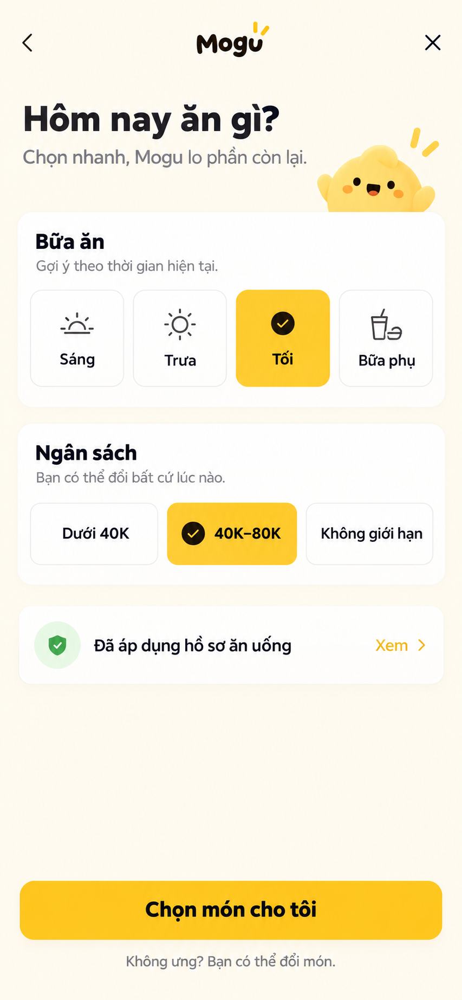
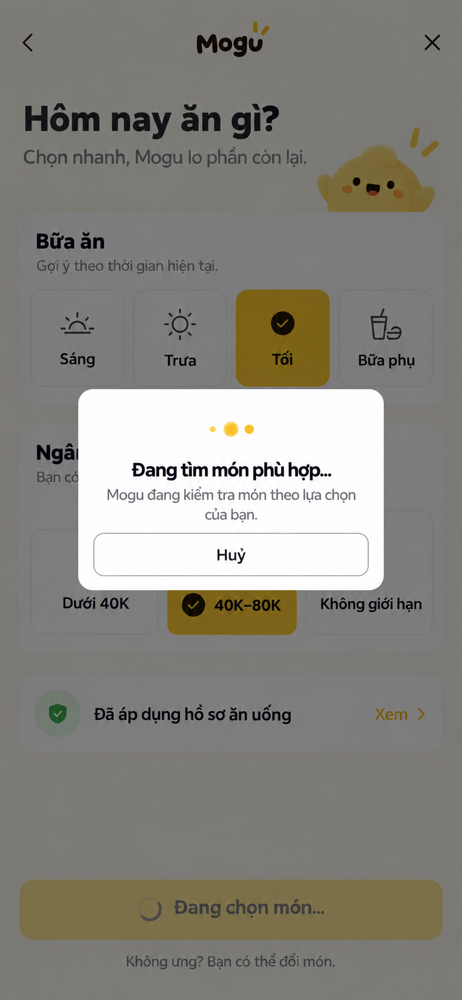
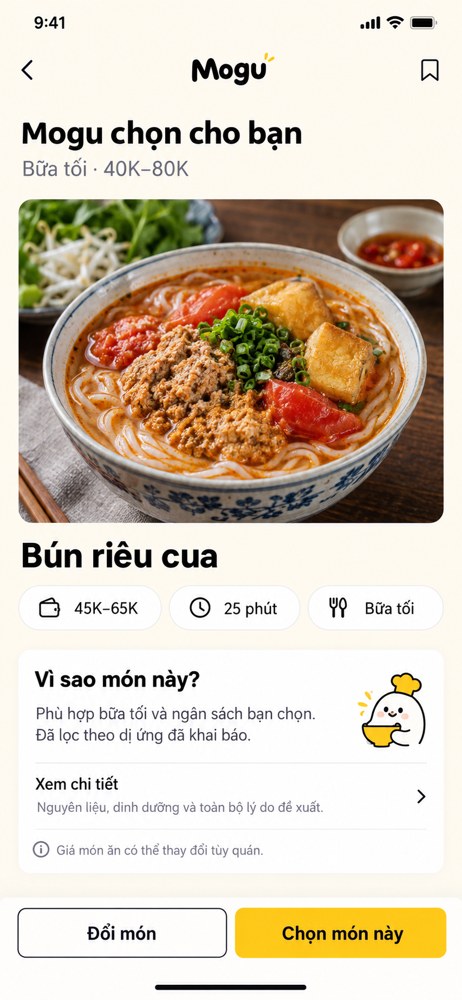
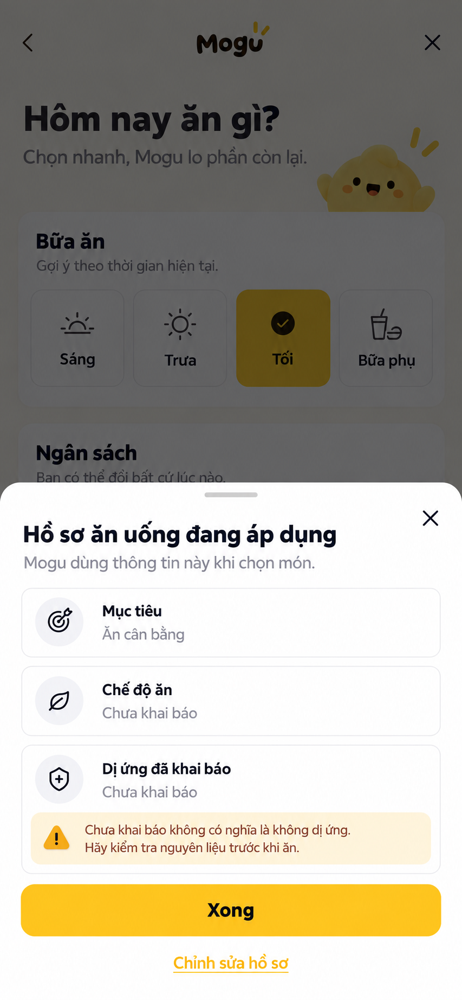
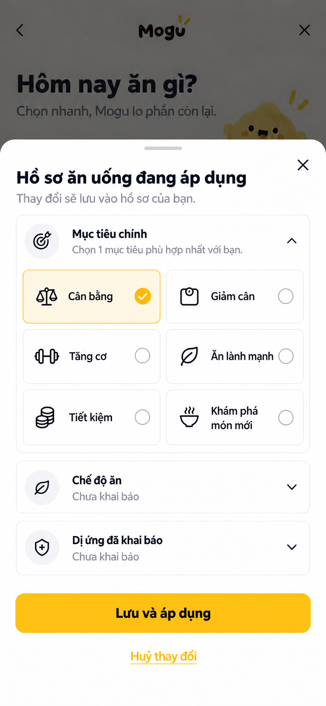
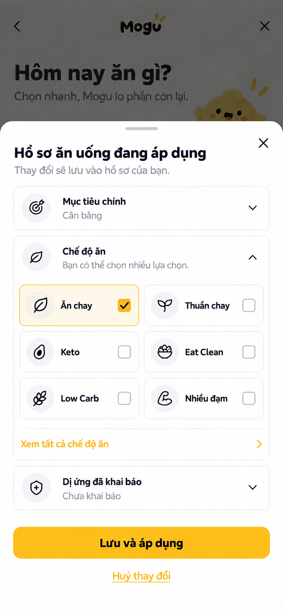
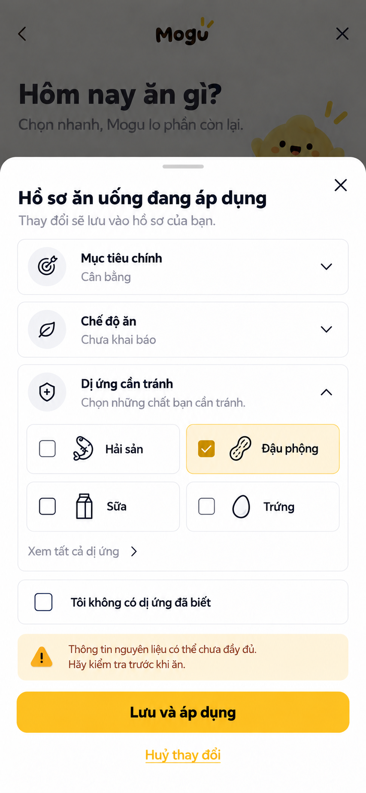

# Thiết kế lại luồng Random món ăn trên mobile

Ngày: 15/09/2026. Phạm vi: đánh giá 4 ảnh giao diện người dùng cung cấp, `mobile/src/screens/RandomFlowScreen.tsx`, `FoodDetailFlowScreen.tsx`, contract `randomization.ts` và backend randomization hiện tại. Đây là đề xuất UX và mockup, **chưa thay đổi code màn Random**.

## Kết luận

Ba bước hiện tại không phải ba quyết định thực sự: người dùng chọn bữa, sang màn khác để chọn ngân sách, rồi xem một màn chờ được đánh số `3/3` trước khi vào kết quả. Đề xuất rút còn **một màn lựa chọn → một màn kết quả**; loading là trạng thái của request, không phải bước điều hướng. Không thể khẳng định phương án này “tối ưu nhất” trước khi thử với người dùng thật, nhưng nó loại bỏ một lần điều hướng và một khoảng chờ nhân tạo có thể đo được.















Bảy ảnh là **concept UI** được tạo bằng built-in imagegen, không phải screenshot app đã triển khai. Khi xây thật, dùng logo/mascot Mogu hiện có trong repo, không dùng lại mascot/wordmark do ảnh concept tự vẽ. Tên món, giá, thời gian, lý do và giá trị hồ sơ trong ảnh là dữ liệu minh hoạ, không được hard-code vào production.

## Những vấn đề quan sát được trong dự án

1. `SelectionStep` và `RefineStep` chia bữa + ngân sách thành hai màn dù cả hai là lựa chọn ngắn, thường được xem và chỉnh cùng nhau. `RefineStep` còn chiếm chỗ cho danh sách hồ sơ dài và các mục “Sắp có” chưa thao tác được.
2. `LoadingScreen` gọi `setTimeout(onDone, 2800)` rồi **mới bắt đầu** `fetchRandom()`: tối thiểu 2,8 giây bị cộng vào thời gian đợi thật. Màn chờ được đánh `BƯỚC 3/3`, khiến request trông như một bước bắt buộc.
3. `onSkip` và `onRandom` đều điều hướng đến step 2, không thay đổi budget. Nút “Bỏ qua để Mogu tự cân đối” vì vậy vẫn gửi mức `40K–80K` mặc định; đây là khác biệt giữa lời UI và request thực tế.
4. Giá trị ban đầu của `meal` là `Trưa`, sau đó mới cập nhật từ `GET /randomization-context`; có thể nháy lựa chọn sai. Sau khi người dùng chọn thủ công, card vẫn ghi “Được chọn tự động”.
5. Sau khi random, result intro và trang thông tin dài tạo cảm giác phải tiếp tục đi qua các lớp nội dung. Nhiều bullet lý do trong ảnh 4 đẩy hành động “Chọn món này” xuống dưới; `compatibilityPercent` nếu hiển thị như cam kết chắc chắn có thể gây hiểu sai.
6. Backend hiện có cascade nới `meal_type`, `soft_diet`, **budget** khi không có ứng viên; không nới dị ứng/hard diet. Ngay ở tầng có budget, truy vấn dùng `priceMin <= budgetMax` và `priceMax >= budgetMin` (giao nhau giữa hai khoảng), nên một món có thể vượt trần thực chi của người dùng. UI không được khẳng định “trong ngân sách” chỉ vì `fallbackApplied` không có `budget`; cần BE trả trạng thái `budgetFit` dựa trên giá ước tính và chính sách rõ ràng. Cũng không được khẳng định “an toàn dị ứng” khi hồ sơ hoặc dữ liệu nguyên liệu thiếu.

## Tham khảo có ý tưởng gần Mogu

- [Eat This Much](https://www.eatthismuch.com/) cho người dùng điều chỉnh diet/nutrition rồi tạo meal plan, đồng thời mô tả việc cá nhân hoá theo preference, budget và schedule. Bài học cho Mogu: giữ các yếu tố cần đổi thường xuyên ở gần nút generate; dữ liệu hồ sơ đã lưu không cần bắt người dùng điền lại.
- [Mealime — Getting Started](https://support.mealime.com/article/151-getting-started-guide) tách auto-builder và self-serve: người muốn nhanh có thể nhận gợi ý, người muốn kiểm soát hơn có thể chỉnh thêm và đổi gợi ý. Bài học: một đường “Mogu chọn” mặc định, tuỳ chỉnh sâu mở theo nhu cầu, và “Đổi món” rõ trên kết quả.
- [SideChef Meal Planner](https://www.sidechef.com/meal-planner/) cho chọn mục tiêu nhanh như budget-friendly rồi cho phép swap/add recipe sau khi xem menu. Bài học: quyết định chính trước, chỉnh món sau; đừng đưa mọi tiêu chí lên wizard đầu vào.
- [Nielsen Norman Group — Progressive Disclosure](https://www.nngroup.com/articles/progressive-disclosure/) khuyên hiển thị các lựa chọn quan trọng trước và để tuỳ chọn hiếm dùng ở tầng thứ hai. Bài viết cũng nêu việc chia quá nhiều màn có thể làm tăng điều hướng khi các lựa chọn cần chỉnh qua lại.
- [Nielsen Norman Group — EAS Framework](https://www.nngroup.com/articles/eas-framework-simplify-forms/) nhấn mạnh loại bỏ câu hỏi dư, tự động hoá thông tin đã biết và dùng default có nguồn gốc rõ; default sai dễ bị giữ nguyên.
- [Nielsen Norman Group — Long Waits](https://www.nngroup.com/articles/designing-for-waits-and-interruptions/) khuyên có trạng thái chờ rõ khi tác vụ thật kéo dài; không suy ra rằng một animation chờ giả giúp trải nghiệm tốt hơn.

Các sản phẩm trên là **tham khảo pattern**, không phải bằng chứng rằng chúng có đúng tính năng random một món theo ngân sách/dị ứng của Mogu.

## Luồng đề xuất

```text
Mở Random
  → GET /randomization-context (không chặn toàn màn; skeleton cho phần chưa có)
  → Một màn: bữa + ngân sách + "Đã áp dụng hồ sơ" (Xem là disclosure)
  → Chọn món cho tôi → POST /randomizations ngay
  → Loading in-place chỉ trong lúc request thật
  → Kết quả: món + giá ước tính + thời gian + 1–2 lý do + Đổi món / Chọn món này
  → Xem chi tiết (tuỳ chọn, không chặn việc chọn)
```

### Màn chọn nhanh

- Giữ hai điều người dùng thường đổi: `meal slot` và `budget`. Mỗi nhóm 3–5 lựa chọn hiện rõ, nút cao tối thiểu 48dp, trạng thái chọn có checkmark **và** màu.
- Mặc định bữa lấy từ `suggestedMealSlot` nếu context hợp lệ; nếu context chưa về, đừng hiện `Trưa` như đã được gợi ý. Cho phép `Bất kỳ` hoặc giữ CTA chờ vài trăm ms khi cần thiết, tuỳ kết quả kiểm thử.
- Mặc định ngân sách **chỉ** lấy từ lựa chọn gần nhất do user lưu hoặc budget profile có nguồn rõ. API hiện không trả default budget, nên nếu chưa có nguồn, chọn `Không giới hạn` và ghi đúng nghĩa; không tự giả là `40K–80K` hoặc “Mogu tự cân đối”. Nếu muốn dựa ngân sách tuần, BE phải trả ngân sách mỗi bữa suy ra cùng nguồn và công thức, không chia tuần thành con số ngầm ở client.
- “Xem” hồ sơ mở bottom sheet gọn có thể **chọn trực tiếp**: mục tiêu, chế độ ăn, dị ứng đã khai báo. Không có dữ liệu thì hiển thị “Chưa khai báo”, không viết “Không có dị ứng”. Không đưa “Sắp có” vào màn chính.
- Chỉ một CTA chính: `Chọn món cho tôi`. Không có `Tiếp tục` hay `Bỏ qua` trùng chức năng.

### Sheet “Hồ sơ ăn uống đang áp dụng”

- Mở khi bấm toàn bộ hàng `Đã áp dụng hồ sơ ăn uống` hoặc `Xem`, không điều hướng khỏi Random. Màn chọn bữa/ngân sách giữ nguyên dưới scrim; lúc mở sheet, các control nền không thể tương tác.
- Tiêu đề nêu rõ **đang áp dụng**; hiển thị ba nhóm: `Mục tiêu`, `Chế độ ăn`, `Dị ứng đã khai báo`. Chạm một hàng mở lựa chọn ngay trong sheet (accordion); không chuyển màn. Chỉ mở một nhóm tại một thời điểm, sheet tăng chiều cao trong giới hạn safe area và vùng chọn cuộn được. Giá trị lấy từ profile snapshot/API, không lấy từ text hard-code trong ảnh. `Cân bằng` trong mockup chỉ là ví dụ.
- `Mục tiêu chính`: radio chọn **một** trong catalog `BALANCE`, `LOSE_WEIGHT`, `BUILD_MUSCLE`, `EAT_HEALTHY`, `SAVE_MONEY`, `EXPLORE`. Không hard-code danh sách/nhãn từ ảnh; BE trả goals đang active và mobile dùng ID/code thật.
- `Chế độ ăn`: checkbox chọn nhiều từ catalog DIET; kiểm tra tổ hợp mâu thuẫn (ví dụ `VEGETARIAN` với `KETO` nếu catalog/policy không hỗ trợ đồng thời). Các tag như `GLUTEN_FREE`/`DAIRY_FREE` không được quảng bá là đã lọc an toàn nếu BE chưa có quy tắc hard-filter và dữ liệu thành phần đầy đủ.
- `Dị ứng cần tránh`: checkbox chọn nhiều từ catalog allergen. `Tôi không có dị ứng đã biết` là lựa chọn **chủ động** và loại trừ lẫn nhau với bất kỳ allergen nào; trạng thái ban đầu là `Chưa khai báo`, không tự tick lựa chọn “không có”. Nếu xoá một dị ứng đã lưu, cần xác nhận rõ vì việc này có thể mở rộng tập món được gợi ý.
- Với chế độ ăn/dị ứng rỗng, dùng `Chưa khai báo` trừ khi API cung cấp trạng thái khai báo tường minh (`DECLARED_NONE`). Mảng `allergenCodes: []` hiện tại không phân biệt được chưa khai báo và người dùng xác nhận không có dị ứng. Cần BE thêm `allergyDeclarationStatus: NOT_DECLARED|DECLARED_NONE|DECLARED_LIST` cùng nhãn đọc được cho các code; không tự biến `[]` thành “Không dị ứng”.
- Khi dị ứng chưa khai báo, hiển thị lưu ý `Chưa khai báo không có nghĩa là không dị ứng. Hãy kiểm tra nguyên liệu trước khi ăn.` Không khẳng định món an toàn tuyệt đối chỉ dựa trên hồ sơ.
- Sheet mặc định chỉ xem: `Xong` hoặc X đóng. Sau khi người dùng sửa lựa chọn, footer đổi thành `Lưu và áp dụng` + `Huỷ thay đổi`. Nhãn phụ `Thay đổi sẽ lưu vào hồ sơ của bạn` nói rõ đây là sửa **hồ sơ lâu dài**, không phải chỉ cho một lượt random. Không auto-save theo từng tap. Bấm X/scrim/vuốt khi có draft chưa lưu phải hỏi giữ hay bỏ thay đổi; nếu không có draft thì đóng ngay. Sau khi PATCH thành công, tải lại context/snapshot rồi dùng bản mới cho request Random; giữ bữa và ngân sách đã chọn.
- Lỗi lưu giữ draft cùng lựa chọn bữa/ngân sách; hiển thị lỗi gần footer với `Thử lại`, không hiện “Đã áp dụng”. Xung đột profile version (`If-Match`) cần reload dữ liệu và cho người dùng so sánh/chọn lại, không ghi đè im lặng.
- Sheet cuộn nội dung nếu tên mục tiêu/chế độ ăn/dị ứng dài, giữ footer và safe area không che nút. Target tối thiểu 44pt iOS/48dp Android; VoiceOver/TalkBack đọc tiêu đề trước, sau đó ba nhóm và cảnh báo; hỗ trợ Dynamic Type, reduced motion và màu tương phản đủ ở cả dark mode.

### Loading in-place

- Bấm CTA gọi API ngay, vô hiệu hoá CTA để tránh gửi trùng. Overlay/card chỉ xuất hiện khi request đủ lâu để người dùng nhận thấy; không có timer 2,8 giây trước khi gọi API.
- Không đánh số bước và không hiển thị phần trăm nếu BE không trả tiến độ thật. `Huỷ` nên huỷ request/đóng overlay theo semantics rõ, không chỉ chuyển màn trong khi response cũ vẫn có thể thắng race.
- Nếu API lỗi, giữ bữa + ngân sách đã chọn; hiện lỗi có `Thử lại` và `Sửa lựa chọn`.

### Màn kết quả

- Trong vùng đầu tiên: ảnh món có URL DB, tên, khoảng giá **ước tính**, thời gian chuẩn bị, một lý do ngắn. Hai nút `Đổi món` và `Chọn món này` luôn nhìn thấy; nguyên liệu, dinh dưỡng, công thức, lý do đầy đủ ở `Xem chi tiết`.
- Nếu thiếu giá, viết `Chưa có giá`, không dùng giá mock. Nếu `fallbackApplied` có `budget`, viết `Mogu đã nới ngân sách để tìm món` và cho sửa/nới ngân sách. Nếu giá ước tính chỉ giao với ngân sách nhưng có thể vượt trần, ghi `Giá có thể vượt ngân sách` thay vì chip “đạt 40K–80K”. Chỉ gắn nhãn `Trong ngân sách` khi BE trả `budgetFit=WITHIN` theo quy tắc đã công bố (ví dụ `priceMax <= budgetMax`); món không đạt hard safety filters không được đưa vào kết quả.
- “Đã lọc theo dị ứng đã khai báo” chỉ hiển thị khi backend xác nhận snapshot và ingredient/allergen data đủ để lọc. Khi thiếu, dùng `Chưa đủ dữ liệu để xác nhận dị ứng` và dẫn tới chi tiết nguyên liệu; không dùng câu “an toàn tuyệt đối”.
- `Đổi món` giữ lựa chọn, exclude món vừa xem, request lại. Không buộc quay về setup, không thêm màn xác nhận; `Chọn món này` thực hiện SELECT rồi chuyển đến trang phù hợp.

## API/data cần cho thiết kế

- `GET /randomization-context`: thêm `suggestedBudget: { mode, minVnd?, maxVnd?, source: LAST_SELECTED|PROFILE|WEEKLY_PLAN|NONE, updatedAt? }`, trạng thái khai báo dị ứng và provenance gợi ý bữa. Nếu chưa làm được, mobile dùng `Không giới hạn` đúng nghĩa.
- Sheet chỉnh hồ sơ dùng catalog goals/DIET/allergens và `PATCH /profile/preferences` với `primaryGoalId`, `dietaryPreferenceIds`, `allergenIds`/`noAllergies` cùng `If-Match` version; chỉ gửi các field được sửa, không xoá vô ý khẩu vị/ưu tiên khác. Vì `dietaryPreferenceIds` hiện thay thế cả danh sách, mobile phải merge giữ các item TASTE đang lưu trước khi gửi DIET mới. Lấy version thật từ `GET /profile/me`: `randomization-context.profileVersion` hiện được tính bằng **số ngày kể từ updatedAt**, không phải `profile.profileVersion`, nên không được dùng cho PATCH; BE cần sửa field này hoặc bỏ nó để tránh nhầm. Sau khi lưu phải refetch, không lấy draft làm bằng chứng thuật toán đã áp dụng.
- **Gap BE cần sửa trước khi gắn nhãn “đã áp dụng”:** Random hiện đọc `goalCodes` từ request (không mặc định lấy mục tiêu đã lưu trong `userGoals`), và hard diet đọc `userDietTypes` trong khi PATCH preferences lưu DIET vào `userDietaryPreferences`. BE cần thống nhất mapping/source of truth và trả `appliedConstraints` cho từng lựa chọn; với nhiều diet, quy tắc cần là giao của các ràng buộc tương thích chứ không chỉ `some/in` (OR) nếu UI nói tất cả đã áp dụng. Dị ứng trong `userAllergens` đã được Random đọc, nhưng vẫn cần trạng thái khai báo tường minh và chất lượng dữ liệu món.
- `POST /randomizations`: gửi `meal.selectionSource` đúng `AUTO_SUGGESTED` hoặc `USER_SELECTED`; `budget.mode` đúng lựa chọn, không đồng nhất `Bỏ qua` với mức cố định. Hỗ trợ idempotency key để double tap/retry không tạo lịch sử trùng.
- Response: `dish.priceMin/priceMax`, `prepMinutes`, `imageUrl`, `explanation.summary/factors/fallbackApplied`, `randomizationId`; thêm `budgetFit: WITHIN|OVERLAPS|OVER|UNKNOWN` cùng `appliedConstraints`/`dataQuality` cho thông điệp dị ứng/ngân sách có bằng chứng. Định nghĩa `WITHIN` theo trần giá ước tính (`priceMax <= budgetMax`), `OVERLAPS` khi chỉ giao khoảng; không lấy score percent làm nhãn “phù hợp 100%” nếu chưa calibration và giải thích ý nghĩa.
- `NO_CANDIDATE`: trả reason codes + relaxable criteria để màn có CTA cụ thể (`Sửa bữa`, `Nới ngân sách`) nhưng **không** đề xuất nới dị ứng/hard diet.

## Kiểm thử trước khi thay luồng cũ

- So sánh luồng cũ/mới bằng thử nghiệm task-based hoặc A/B: thời gian từ mở Random đến món đầu tiên, số tap/transition trước request, tỷ lệ hoàn thành, tỷ lệ đổi món, tỷ lệ chỉnh budget, lỗi/no-candidate và tỷ lệ người dùng hiểu đúng thông báo nới ngân sách.
- Thử trên máy nhỏ khoảng 375px, font hệ thống lớn, landscape, VoiceOver/TalkBack, reduced motion, mạng chậm/offline. Kiểm tra CTA và sheet không bị che bởi safe area; mọi target tối thiểu 44pt iOS/48dp Android.
- Không đặt mục tiêu “ít bước” bằng mọi giá: nếu người dùng cần kiểm soát nhiều hơn, disclosure phải dễ tìm và kết quả phải giải thích đủ để họ tin quyết định.

## Prompt set tạo mockup

Built-in imagegen, taxonomy `ui-mockup` cho màn setup/result và `precise-object-edit` cho loading/profile sheet: (1) một màn Mogu cream/yellow gồm bữa + ngân sách + profile disclosure + CTA; (2) chỉnh trạng thái chờ trên setup; (3) kết quả món; (4) giữ nguyên màn setup tham chiếu, thêm scrim và sheet xem hồ sơ; (5) mở `Mục tiêu chính` với sáu radio goal từ seed; (6) mở `Chế độ ăn` với checkbox và `Xem tất cả`; (7) mở `Dị ứng cần tránh` với checkbox, xác nhận “không dị ứng đã biết” tách biệt và cảnh báo dữ liệu nguyên liệu. Ảnh generated cần được kiểm tra lại trước khi chuyển thành asset/code.
